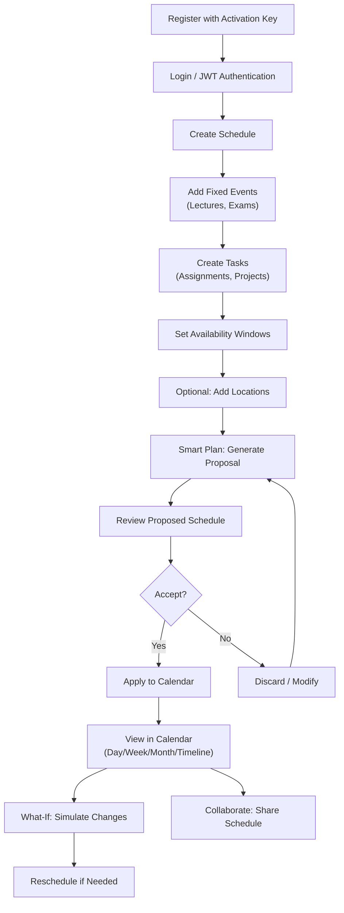
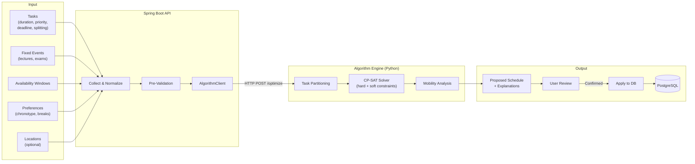
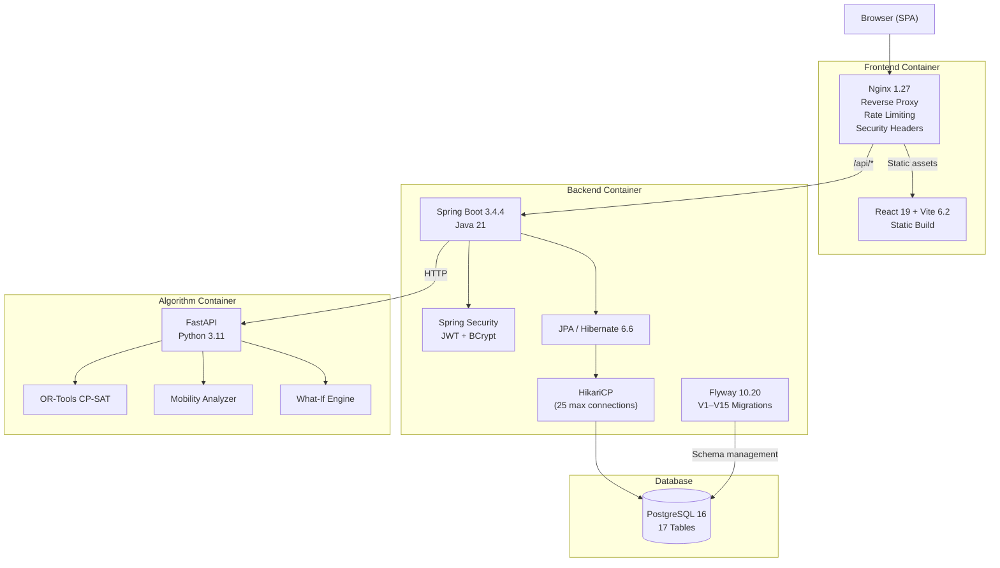
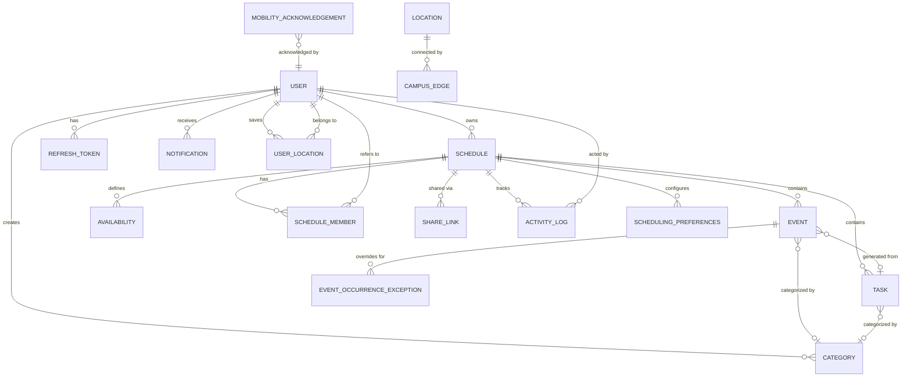
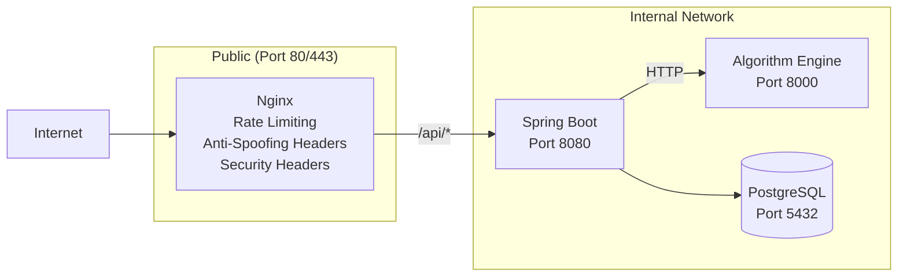
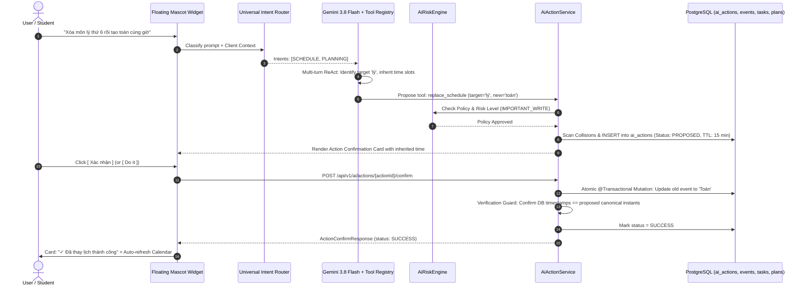

# SmartSchedule

**From constraints to a collision-free, explainable schedule.**

SmartSchedule is a full-stack scheduling and productivity platform that transforms fixed university commitments, tasks, deadlines, availability windows, workload preferences, conflict rules, and physical campus mobility constraints into an optimized, explainable schedule that users review and control before applying.

The system produces a **proposal** — it never silently overwrites the user's calendar.

```text
Suggest → Explain → Review → User Decides → Confirm → Apply
```

[](VERSION)
[](backend/pom.xml)
[](frontend/package.json)
[](docker-compose.yml)
[](algorithm-engine/requirements.txt)
[](backend/pom.xml)
[](frontend/package.json)
[](algorithm-engine/Dockerfile)

---

## Table of Contents

- [Problem Statement](#problem-statement)
- [Why SmartSchedule?](#why-smartschedule)
- [Complete Feature Inventory](#complete-feature-inventory)
- [Feature Matrix](#feature-matrix)
- [User Journey](#user-journey)
- [Smart Scheduling Flow](#smart-scheduling-flow)
- [System Architecture](#system-architecture)
- [Frontend Architecture](#frontend-architecture)
- [Backend Architecture](#backend-architecture)
- [Database Architecture](#database-architecture)
- [Scheduling Engine](#scheduling-engine)
- [Mobility Engine](#mobility-engine)
- [What-If Simulation](#what-if-simulation)
- [Collaboration](#collaboration)
- [3D Landing Page](#3d-landing-page)
- [Authentication & Security](#authentication--security)
- [SmartSchedule Full-Scope AI Agent (Autonomous Academic Operating System)](#smartschedule-full-scope-ai-agent-autonomous-academic-operating-system)
- [Performance & Testing](#performance--testing)
- [Deployment](#deployment)
- [Repository Structure](#repository-structure)
- [Environment Configuration](#environment-configuration)
- [Quick Start](#quick-start)
- [Testing](#testing)
- [Known Limitations](#known-limitations)
- [Roadmap](#roadmap)
- [Contributing](#contributing)
- [Release Information](#release-information)

---

## Problem Statement

University students and professionals face scheduling problems that standard calendar applications cannot solve:

| Problem | Why Normal Calendars Fail |
| :--- | :--- |
| **Fixed schedules** — Lectures, labs, and exams are immovable | Calendars show them but cannot reason about the remaining free time |
| **Too many tasks** — Assignments, projects, reading, revision | Calendars have no concept of task duration, splitting, or prioritization |
| **Deadline pressure** — Multiple deadlines cluster together | No automatic deadline-proximity awareness or workload balancing |
| **Time conflicts** — Overlapping events go undetected until too late | Basic conflict detection exists, but no resolution suggestions |
| **Unbalanced workload** — 8 hours on Monday, nothing on Tuesday | No capacity modeling or workload distribution |
| **Task splitting** — A 6-hour project needs multiple sessions | No understanding of minimum/maximum session lengths |
| **Travel between locations** — Walking 15 minutes between campus buildings | Zero awareness of physical geography or transit time |
| **Changing plans** — A new class added mid-semester disrupts everything | No impact simulation before committing changes |
| **What-if scenarios** — "What if I move this exam prep?" | No sandbox simulation capability |
| **Calendar fragmentation** — Scattered 20-minute gaps everywhere | No gap analysis or consolidation intelligence |
| **Collaboration** — Sharing schedules with study groups | Limited multi-user permission models |

SmartSchedule addresses these combined constraints through a deterministic constraint-programming solver (Google OR-Tools CP-SAT), physical campus mobility analysis, what-if simulation, and a user-controlled review workflow that ensures the human always makes the final decision.

---

## Why SmartSchedule?

| Principle | Implementation |
| :--- | :--- |
| **Deterministic** | Identical inputs produce identical schedules. The CP-SAT solver uses a SHA-256 hash of inputs as its random seed. |
| **Explainable** | Every scheduling decision includes reasoning: why a task was placed at a specific time, which constraints were active, and what alternatives were considered. |
| **User-controlled** | The scheduler produces a proposal. The user reviews proposed time slots, sees conflict analysis, and explicitly applies or discards the plan. |
| **Constraint-aware** | Hard constraints (fixed events, deadlines, availability) are never violated. Soft constraints (preferences, workload balance, chronotype) are optimized. |
| **Persistent** | All data lives in PostgreSQL with Flyway-managed schema migrations. No in-memory-only state. |
| **Multi-user** | Each user's data is strictly isolated. Collaboration is explicit through schedule membership with role-based access (OWNER, EDITOR, VIEWER). |
| **Mobility-aware** | Physical campus transit times between buildings are factored into scheduling feasibility. |
| **Production-oriented** | No demo fallback in production mode. Real authentication, real database, real constraints. |

---

## Complete Feature Inventory

### Authentication & Account Management

- **Registration** with activation key gate (`SMARTSCHEDULE_REGISTRATION_KEY`) to control beta access
- **Login** with email/password, returning JWT access token and HttpOnly refresh cookie
- **Logout** with server-side refresh token revocation and cookie clearing
- **JWT authentication** using HMAC-SHA256 (jjwt 0.12.6), 15-minute access token TTL
- **Refresh token rotation** — each refresh issues new token pair, old token hash invalidated
- **Password hashing** with BCrypt (Spring Security default)
- **Current user** endpoint (`GET /api/v1/auth/me`) returns profile and subscription tier
- **User profile update** (`PATCH /api/v1/users/me`) for name and preferences
- **Plan tier management** — `ALL_PRO` mode grants all users full feature access during beta; `STANDARD` mode enforces FREE/PRO tier gating
- **Rate limiting** — configurable per-endpoint limits (registration: 5/min, login: 15/min, refresh: 30/min) via Spring filter + Nginx `limit_req_zone`

### Scheduling & Optimization

- **Smart Plan Generate** — sends tasks, events, availability, and constraints to the CP-SAT algorithm engine; receives a proposed schedule with explanations
- **Smart Plan Validate** — checks a proposed plan against current schedule state before applying
- **Smart Plan Apply** — commits validated proposals to the database as calendar events, with optimistic locking (`@Version`) to prevent concurrent overwrites
- **Hard constraints** — fixed/locked events, deadline compliance, availability window enforcement, conflict prevention
- **Soft constraints** — priority weighting (URGENT: 1000, HIGH: 500, MEDIUM: 200, LOW: 100), deadline proximity bonus, preferred study time matching, workload balance
- **Task splitting** — respects `minimumSessionMinutes` and `maximumSessionMinutes`; partitions large tasks into multiple sessions
- **Remaining duration tracking** — `remainingMinutes = max(0, estimatedDuration - sum(linkedScheduledDuration))`
- **Conflict detection** — `POST /api/v1/events/check-conflict` and `GET /api/v1/schedules/{id}/conflicts`
- **Conflict analysis** — `ConflictAnalysisService` provides structured overlap reports with hard/soft distinction
- **Schedule versioning** — `@Version` column on Schedule entity for optimistic concurrency control
- **What-if simulation** — dry-run schedule mutations in a sandbox without database commits
- **Rescheduling** — analyze impact, generate alternatives, and apply rescheduling decisions
- **AI recommendation** — `GET /api/v1/schedules/{id}/scheduling/ai-recommendation`
- **Quick slot application** — `POST /api/v1/schedules/{id}/scheduling/apply-quick-slot`
- **Academic KPI summary** — `GET /api/v1/schedules/{id}/scheduling/academic-summary`
- **Scheduling preferences** — per-schedule preferences stored in `scheduling_preferences` table

### Calendar

- **Day view** — FullCalendar `timeGridDay` with 15-minute slot resolution
- **Week view** — FullCalendar `timeGridWeek` with drag-and-drop event editing
- **Month view** — FullCalendar `dayGridMonth` overview
- **List/Agenda view** — FullCalendar `listWeek` for linear event listing
- **Timeline view** — custom `TimelineView` component for resource-oriented visualization
- **Quarter view** — custom `QuarterView` component for multi-month planning
- **Year view** — custom `YearView` component for annual overview
- **24-hour grid** — configurable `slotMinTime`/`slotMaxTime` from `00:00:00` to `24:00:00`
- **Period toggles** — text-only segment bar for Buổi sáng (06:00–13:00), Buổi chiều (12:00–18:30), Buổi tối (18:00–24:00), 24 Giờ
- **Current-time indicator** — live red line via FullCalendar `nowIndicator`
- **Drag and drop** — event resizing and moving via `@fullcalendar/interaction`
- **Quick create** — `QuickCreatePopover` for rapid event creation from empty time slots
- **Event popover** — `EventCompactPopover` with quick actions (edit, delete, duplicate)
- **Event detail drawer** — `EventDetailDrawer` for full event editing
- **Event form** — `EventForm` with validation via `react-hook-form` + `zod`
- **Conflict panel** — `ConflictPanel` for visualizing scheduling conflicts
- **Context menu** — `CalendarContextMenu` for right-click calendar actions
- **Mini calendar** — `MiniCalendar` sidebar navigation widget
- **Mobile day strip** — `MobileDayStrip` for responsive mobile calendar view
- **Recurrence editor** — `RecurrenceEditor` for creating recurring event rules
- **Calendar toolbar** — `CalendarToolbar` with view switching and date navigation
- **Right assistant panel** — `CalendarRightAssistantPanel` for sidebar scheduling insights
- **AI planner bar** — `CalendarAiPlannerBar` for in-calendar optimization triggers
- **Header summary** — `CalendarHeaderSummary` showing day/week statistics
- **Calendar history** — `useCalendarHistory` hook for undo/redo navigation
- **Long-range metrics** — `longRangeMetrics.ts` utilities for quarter/year workload analysis

### Tasks

- **CRUD operations** — create, read, update, patch, delete tasks
- **Estimated duration** — total planned minutes for the task
- **Remaining duration** — calculated remaining minutes after scheduled sessions
- **Priority levels** — LOW, MEDIUM, HIGH, URGENT
- **Deadline tracking** — with date-range filtering
- **Categories** — color-coded categorization linked to user-defined categories
- **Status tracking** — task completion states
- **Pagination** — server-side pagination with page/size parameters
- **Task filtering** — by status, priority, category, deadline range (`taskFiltering.ts`)
- **Natural language input** — `NlpTaskInput` component with `naturalLanguageParser.ts` for Vietnamese/English task parsing
- **Task calculations** — `taskCalculations.ts` for duration and progress computation
- **Quick add composer** — `QuickAddComposer` for rapid task creation
- **Task cards** — `TaskCard` component with visual priority indicators

### Events

- **CRUD + Duplicate** — full lifecycle management with event cloning
- **Fixed/Locked flags** — immovable events that the scheduler must work around
- **ISO timestamp ranges** — `startsAt`/`endsAt` with `Instant` precision
- **Category assignment** — linked to color-coded categories
- **Recurrence rules** — via `RecurrenceService` and `event_occurrence_exceptions` table
- **Occurrence exceptions** — individual occurrence overrides for recurring events
- **Source task linking** — events generated by the scheduler link back to their source task via `sourceTaskId`
- **Calendar interop** — ICS export (`GET /api/v1/schedules/{id}/export.ics`) and import (`POST /api/v1/schedules/{id}/import.ics`)

### Mobility & Location

- **Optional location** — events and tasks can optionally specify a physical location
- **User-defined locations** — `UserLocation` CRUD for saving custom campus locations
- **System locations** — `Location` entities with `LocationType` enum (CAMPUS, ONLINE, OFF_CAMPUS, CUSTOM)
- **Campus edge graph** — `CampusEdge` entities defining walking distances between campus buildings
- **Travel estimation** — `GET /api/v1/travel/estimate?from={id}&to={id}` returns `TravelEstimate` with duration
- **Campus routing** — `CampusRoutingService` with graph-based shortest-path estimation
- **OSM routing provider** — `OsmRoutingProvider` implementing `RoutingProvider` interface for external routing
- **Mobility checking** — `MobilityCheckService` evaluates schedule feasibility
- **Mobility acknowledgement** — users can acknowledge and dismiss mobility warnings
- **Candidate mobility check** — `POST /api/v1/events/check-mobility` evaluates transit feasibility before creating events
- **Algorithm-engine mobility analysis** — `POST /analyze-mobility` endpoint detects zig-zag routes, domino transition risks, and travel-heavy sessions
- **Route efficiency scoring** — 0.0 to 1.0 score based on tight transitions, zig-zags, and travel-to-session ratios
- **Frontend campus routing** — `campusRouting.ts` with client-side route visualization

### Collaboration

- **Schedule membership** — OWNER, EDITOR, VIEWER roles via `ScheduleMember` entity
- **Member invitation** — `POST /api/v1/schedules/{id}/members` with role assignment
- **Role management** — update and remove member roles
- **Share links** — tokenized public access URLs via `ShareLink` entity with expiration
- **Share link revocation** — `DELETE /api/v1/schedules/{id}/share-links/{linkId}`
- **Public schedule view** — `GET /api/v1/shared/{token}` for anonymous read access
- **Activity logs** — `ActivityLog` entity tracking schedule modifications with actor, action, and timestamp
- **Team availability** — `GET /api/v1/schedules/{id}/team-availability` computes overlapping free slots across members
- **Meeting suggestions** — `GET /api/v1/schedules/{id}/meeting-suggestions` proposes optimal meeting times

### Dashboard

- **Hero banner** — `DashboardHeroBanner` with campus imagery and time-of-day greeting
- **KPI metrics** — `DashboardKpiCards` and `KpiMetricsRow` showing schedule statistics
- **Today's classes** — `TodayClassesCard` with current day's event list
- **Schedule timeline** — `ScheduleCard` with `CurrentTimeIndicator` and `ScheduleTimeline`
- **Gap suggestions** — `ScheduleGapSuggestion` identifying unused time blocks
- **Pending tasks** — `PendingTasksCard` with upcoming task deadlines
- **Deadline tracking** — `DeadlineCard` and `DeadlineItem` components
- **Workload chart** — `WorkloadCard` with `WorkloadChart`, `ChartAxis`, `ChartLegend`, `ChartTooltip`
- **AI suggestions** — `TodayAiSuggestionCard` with schedule improvement recommendations
- **Smart insights** — `SmartInsightBanner` with contextual scheduling observations
- **Quick actions** — `QuickActionsCard` for common operations
- **Self-study booking** — `SelfStudyBookingCard` for scheduling study blocks
- **Weekly timetable** — `WeeklyTimetableCard` showing week overview
- **Schedule proposals** — `DashboardScheduleProposalCard` for pending optimization proposals
- **Detail modal** — `DashboardDetailModal` for expanded item views
- **Mobile layout** — `MobileDashboard` responsive variant
- **Skeleton loading** — `DashboardSkeleton` for progressive content loading
- **Live weather** — `useLiveWeather` hook for local weather display
- **QuyNhon quote** — `QuyNhonQuoteCard` with campus-themed motivational content
- **Dashboard data** — `useDashboardData` hook, `chartCalculations.ts`, `insightGenerator.ts`
- **Appearance settings** — `DashboardAppearanceSection` in settings

### Settings

- **User profile** — edit name, email, preferences
- **Dashboard appearance** — `DashboardAppearanceSection` for layout customization
- **User locations** — `UserLocationsSection` for managing saved campus locations
- **Integrations** — `IntegrationsSection` for external service connections
- **Open API** — `OpenApiSection` for API key management

### Notifications

- **In-app notifications** — `NotificationsPage` with paginated notification list
- **Read/unread tracking** — mark individual or all notifications as read
- **Reminder jobs** — `ReminderJob` background service triggered by configurable delay

### Browser Extension — Universal Schedule Importer

- **Manifest V3 Extension** — Chrome & Edge extension (`extension/`) for extracting student timetables
- **Zero Credential Collection** — Never inspects passwords, cookies, or session tokens; reads only visible timetable DOM
- **Dynamic Rule Engine** — Decoupled JSON rules with versioning, checksum validation, and remote refresh from backend
- **Supported Portals** — Verified FPT Academic Portal (FAP) adapter + verified Edusoft adapter with fixture integration tests
- **Universal Schema Normalization** — Converts portal DOM into canonical `UniversalScheduleItem` with timezone normalization (`Asia/Ho_Chi_Minh`)
- **Idempotent Import** — Generates deterministic event fingerprints to prevent duplicates on re-import
- **In-Browser Preview & Conflict Detection** — Interactive popup preview with warning badges, subject count, and schedule selection
- **Backend Import API** — `POST /api/v1/schedules/{id}/import/portal` with atomic transaction, conflict resolution, and `schedule_imports` audit trail

### SmartSchedule Full-Scope AI Agent (Autonomous Academic Operating System)

- **Universal Multi-Intent Router (`AiAgentRouter.java`)** — Classifies complex, mixed user requests across 14 capability areas (`HELP`, `QUERY`, `SEARCH`, `NAVIGATION`, `SCHEDULE`, `TASK`, `DEADLINE`, `REMINDER`, `PLANNING`, `OPTIMIZATION`, `DOCUMENT`, `ANALYTICS`, `SETTINGS`, `PROFILE`) with multi-intent decomposition and mutation intent preservation.
- **Centralized Tool Registry (`AiToolRegistry.java`)** — Dynamic catalog defining and registering **28 OpenAPI/Gemini function declarations** covering live read tools, safe low-write mutations, important confirmed writes, and multi-step batch executions.
- **Multi-Tier Risk Engine (`AiRiskEngine.java`)** — 4-tier security gating (`READ`, `LOW_WRITE`, `IMPORTANT_WRITE`, `HIGH_RISK`):
  - `READ`: Automatic query execution for schedules, tasks, deadlines, free time, preferences, and analytics.
  - `LOW_WRITE`: Smooth single-click mutations (`complete_task`, `navigate_to`, `update_user_preferences`).
  - `IMPORTANT_WRITE`: Mandatory interactive Action Confirmation Card before modifying schedules, tasks, deadlines, or plans.
  - `HIGH_RISK`: Hard policy blocking of hazardous actions (account deletion, database wipe) via AI, redirecting users to native system settings.
- **Zero-Hallucination & Anti-Guessing Engine** — Enforces strict required-field schemas (`title`, `date`, `start_time`, `end_time`/`duration`). The AI NEVER silently invents or hallucinates times (e.g. 08:00 or 08:00–09:30) or rooms; it prompts targeted, concise clarification questions when details are missing.
- **Single Source of Truth (`canonicalParams`)** — Ensures the proposed Action Card and actual database mutation use identical computed `Instant` timestamps and metadata, guarded by post-execution database verification.
- **Atomic Multi-Step Batch Action Plans (`AiActionPlan.java`, Flyway `V21`)** — Coordinates chained actions (e.g., 10-day exam prep, swap/replace routines) under a single review plan with unified `[ Xác nhận tất cả (Do it) ]` execution and atomic rollback on failure.
- **Whitelisted Client-Side Navigation** — Executes `navigate_to` strictly within a secure whitelist (`/dashboard`, `/calendar`, `/tasks`, `/scheduling`, `/rescheduling`, `/collaboration`, `/notifications`, `/settings`, `/profile`) via custom event dispatch (`smartschedule:navigate`).
- **Academic Document & Syllabus Parser** — Analyzes syllabus and coursework text to extract assignments, test dates, and deadlines.
- **Academic Performance Analytics** — Summarizes weekly committed study hours, free blocks, and task completion ratios.
- **Subject Alias & Fuzzy Matching** — Recognizes academic shorthand (e.g., "lý" ↔ "Vật lý" / "Physics", "toán" ↔ "Toán học" / "Calculus") for natural, zero-friction schedule swaps.
- **Floating Mascot & Draggable Physics** — Omnipresent assistant (`AIChatWidget.tsx`, `AIChatBubble.tsx`) with boundary snapping and conversation persistence across mobile and desktop.
- **Interactive Action Cards (`AIActionCard.tsx`)** — 6-state lifecycle (`PROPOSED`, `CONFIRMED`, `EXECUTING`, `SUCCESS`, `FAILED`, `CANCELLED`), 15-minute TTL, double-click protection, conflict banners with alternative finder, and batch action step-by-step review list.


### Landing Page & 3D

- **3D hero scene** — `HeroScene.tsx` using React Three Fiber (`@react-three/fiber` 9.7) and Three.js (`three` 0.186)
- **3D mascot model** — `MascotModel.tsx` loading GLB files from `public/models/` with `@react-three/drei` 10.7
- **Geometric fallback** — `GeometricMascotFallback` component for WebGL-unavailable environments
- **Closing 3D scene** — `ClosingScene.tsx` with auto-rotating mascot and `OrbitControls`
- **Scroll-driven sections** — `AnimatedSection.tsx` with Framer Motion (`framer-motion` 13.4) intersection-observer animations
- **Problem section** — `ProblemSection.tsx` with staggered card entrance animations
- **Transformation section** — `TransformationSection.tsx` with before/after comparison
- **Smart Plan section** — `SmartPlanSection.tsx` with pipeline visualization
- **Mobility section** — `MobilitySection.tsx` with interactive campus demo
- **What-If section** — `WhatIfSection.tsx` with slider-based simulation preview
- **Control section** — `ControlSection.tsx` with step-by-step user workflow
- **Landing navbar** — `LandingNavbar.tsx` with scroll-aware navigation
- **Landing footer** — `LandingFooter.tsx` with technology credits
- **Brand assets** — `brandAssets.ts` with icon and color definitions
- **Landing CSS** — `landing.css` with custom styling and responsive breakpoints
- **Lazy loading** — GLB models loaded via React `Suspense` boundaries

---

## Feature Matrix

| Feature | Status | Frontend | Backend | Algorithm Engine |
| :--- | :---: | :--- | :--- | :--- |
| JWT Authentication | ✅ | `authStore.ts`, `AuthPages.tsx` | `AuthController`, `JwtService` | — |
| Registration Key Gate | ✅ | Registration form | `AuthService` | — |
| Rate Limiting | ✅ | — | `RateLimitingFilter` | — |
| Schedule CRUD | ✅ | `SchedulesPage.tsx` | `ScheduleController` | — |
| Task CRUD | ✅ | `TasksPage.tsx`, `SchedulingPage.tsx` | `TaskController` | — |
| Event CRUD + Duplicate | ✅ | `CalendarPage.tsx`, `EventForm.tsx` | `EventController` | — |
| Availability Management | ✅ | Calendar UI | `AvailabilityController` | — |
| Category Management | ✅ | Settings/Scheduling | `CategoryController` | — |
| Smart Plan (Generate) | ✅ | `SchedulingPage.tsx` | `SchedulingController` | `cp_solver.py` |
| Smart Plan (Validate) | ✅ | `SchedulingPage.tsx` | `SchedulingController` | — |
| Smart Plan (Apply) | ✅ | `SchedulingPage.tsx` | `SchedulingController` | — |
| What-If Simulation | ✅ | `ReschedulingPage.tsx` | `SchedulingController` | `what_if_engine.py` |
| Rescheduling | ✅ | `ReschedulingPage.tsx` | `ReschedulingController` | — |
| Mobility Analysis | ✅ | `campusRouting.ts` | `LocationController` | `mobility_analyzer.py` |
| Campus Travel Estimation | ✅ | Calendar UI | `CampusRoutingService` | — |
| Collaboration (OWNER/EDITOR/VIEWER) | ✅ | `CollaborationPage.tsx` | `CollaborationController` | — |
| Share Links | ✅ | `CollaborationPage.tsx` | `CollaborationController` | — |
| Public Schedule View | ✅ | `PublicSchedulePage.tsx` | `CollaborationController` | — |
| Activity Logs | ✅ | `CollaborationPage.tsx` | `ActivityLogService` | — |
| ICS Import/Export | ✅ | Calendar UI | `CalendarInteropController` | — |
| Notifications | ✅ | `NotificationsPage.tsx` | `NotificationController` | — |
| Recurrence Rules | ✅ | `RecurrenceEditor.tsx` | `RecurrenceService` | — |
| 3D Landing Page | ✅ | `HeroScene.tsx`, `MascotModel.tsx` | — | — |
| Framer Motion Animations | ✅ | `AnimatedSection.tsx`, sections | — | — |
| Dashboard Analytics | ✅ | `DashboardPage.tsx`, cards | Health/Pool endpoints | — |
| Natural Language Task Input | ✅ | `NlpTaskInput.tsx` | — | — |
| AI Floating Chat Widget | ✅ | `AIChatWidget.tsx`, `AIChatBubble.tsx` | `AiController.java` | — |
| Gemini Streaming SSE Chat | ✅ | `aiChatStore.ts`, `AIChatPanel.tsx` | `AiChatService.java`, `GeminiProvider.java` | Google Gemini 1.5 |
| AI Deterministic Read Tools | ✅ | `AIChatMessages.tsx` | `AiContextService.java` | Google Gemini 1.5 |
| AI Action Cards (Write Tools + Conflict) | ✅ | `AIActionCard.tsx` | `AiActionService.java` | Google Gemini 1.5 |
| Optimistic Locking | ✅ | — | `@Version` on entities | — |
| Docker Compose Deployment | 🟡 | `Dockerfile` | `Dockerfile` | `Dockerfile` |
| HTTPS / SSL | 🟡 | — | — | — |
| Linux Container Runtime | 🟡 | — | — | — |

> **Legend**: ✅ Implemented · 🟡 Configured but requires deployment environment

---

## User Journey



---

## Smart Scheduling Flow



### Flow Stages

1. **Collect & Normalize** — The Spring Boot `SchedulingService` gathers tasks (with calculated `remainingMinutes`), fixed events, availability windows, scheduling preferences, and location data for the specified schedule.

2. **Pre-Validation** — Checks schedule ownership, version consistency, and basic input sanity before sending to the algorithm engine.

3. **Task Partitioning** — The CP-SAT solver's `_partition_task()` function splits tasks into sessions respecting `minimumSessionMinutes` and `maximumSessionMinutes`. Target chunk size is 60–90 minutes.

4. **CP-SAT Solver** — Google OR-Tools builds interval variables for each session, enforces no-overlap with fixed events, respects availability windows, and maximizes a weighted objective function combining priority scores, deadline proximity, and preference matching.

5. **Mobility Analysis** — After scheduling, the mobility analyzer evaluates physical transitions between locations, detecting domino risks, zig-zag routes, and travel-heavy sessions.

6. **User Review** — The frontend presents the proposal with explanations. Each proposed slot shows why it was chosen and what constraints were active. The user can accept or discard.

7. **Apply** — On confirmation, the Spring Boot API creates `Event` entities linked to their source tasks via `sourceTaskId`, using optimistic locking to prevent concurrent schedule corruption.

---

## System Architecture



### Port Boundaries

| Service | Port | Exposure | Notes |
| :--- | :---: | :--- | :--- |
| **Nginx** | `80`, `443` | Public | Only publicly exposed service |
| **Spring Boot** | `8080` | Internal only | `expose` in Docker Compose, not `ports` |
| **PostgreSQL** | `5432` | Internal only | `expose` in Docker Compose, not `ports` |
| **Algorithm Engine** | `8000` | Internal only | Accessed by Spring Boot via `AlgorithmClient` |

---

## Frontend Architecture

### Technology Stack

| Library | Version | Purpose |
| :--- | :--- | :--- |
| React | 19.0 | UI framework |
| TypeScript | 5.8 | Type safety |
| Vite | 6.2 | Build tool and dev server |
| React Router DOM | 7.5 | Client-side routing |
| Tailwind CSS | 4.1 | Utility-first styling |
| Zustand | 5.0 | Lightweight state management |
| Axios | 1.8 | HTTP client |
| FullCalendar | 6.1 | Calendar views (day, week, month, list, timegrid) |
| Three.js | 0.186 | 3D rendering engine |
| React Three Fiber | 9.7 | React renderer for Three.js |
| @react-three/drei | 10.7 | Three.js helper components |
| Framer Motion | 13.4 | Animation library |
| Lucide React | 1.47 | Icon library |
| React Hook Form | 7.55 | Form state management |
| Zod | 3.24 | Schema validation |
| Vitest | 3.0 | Unit testing |
| Playwright | 1.63 | End-to-end testing |

### Feature-Based Structure

The frontend is organized by feature domain, each containing its page component, sub-components, hooks, utilities, services, and tests:

```text
frontend/src/features/
├── auth/           Authentication pages (login, register)
├── calendar/       FullCalendar integration, views, event management
├── collaboration/  Schedule sharing, member management
├── dashboard/      Analytics dashboard with KPI cards, charts
├── landing/        3D landing page with scroll-driven sections
├── notifications/  In-app notification feed
├── rescheduling/   Schedule adjustment workflows
├── schedules/      Schedule CRUD management
├── scheduling/     Smart Plan UI, task workspace, constraints
├── settings/       User preferences, locations, integrations
├── sharing/        Public schedule viewer
└── tasks/          Task management with NLP input
```

### State Management

- **`authStore.ts`** — JWT token storage, user profile, login/logout state
- **`preferenceStore.ts`** — UI preferences persisted across sessions
- **`historyStore.ts`** — Navigation and action history for undo/redo
- **`workspaceStore.ts`** — Active schedule context and workspace state

### API Layer

All backend communication flows through `services/apiClient.ts` (Axios instance with interceptors for JWT injection, token refresh on 401, and error normalization). Feature-specific API modules:

`authApi.ts` · `scheduleApi.ts` · `eventApi.ts` · `taskApi.ts` · `availabilityApi.ts` · `categoryApi.ts` · `schedulingApi.ts` · `reschedulingApi.ts` · `locationApi.ts` · `travelApi.ts` · `collaborationApi.ts` · `notificationApi.ts` · `conflictApi.ts` · `publicScheduleApi.ts` · `userApi.ts` · `icsService.ts` · `calendarSyncEngine.ts` · `openApiIntegration.ts`

### Demo Mode Architecture

`demoMode.ts` and `demoBackend.ts` provide a client-side simulation layer for development without a running backend. In production (`VITE_API_MODE=real`), this is completely bypassed — all API calls go to the real Spring Boot backend.

---

## Backend Architecture

### Technology Stack

| Component | Technology | Version |
| :--- | :--- | :--- |
| Framework | Spring Boot | 3.4.4 |
| Language | Java | 21 |
| Security | Spring Security | 6.4 |
| ORM | Hibernate / JPA | 6.6 |
| Connection Pool | HikariCP | Managed |
| Database Driver | PostgreSQL JDBC | 42.7.5 |
| Schema Management | Flyway | 10.20 |
| JWT | jjwt (io.jsonwebtoken) | 0.12.6 |
| Validation | Jakarta Bean Validation | Managed |
| Build | Maven | 3.9+ |

### Domain Architecture (115+ Java Source Files)

The backend follows a strict **modular monolith** pattern with domain-driven package structure:

```text
com.smartschedule/
├── ai/                Google Gemini 1.5 Assistant, function calling, action execution
├── auth/              Authentication, JWT, refresh tokens, rate limiting
├── availability/      Weekly recurring availability windows
├── calendar/          ICS import/export interoperability
├── category/          Color-coded task/event categories
├── common/            Health endpoints, audit logging, error handling
├── config/            Security configuration, JSON handlers
├── event/             Calendar events, recurrence, conflict analysis
├── location/          Campus locations, routing, mobility checks
├── notification/      In-app notifications, reminder scheduling
├── plan/              Plan mode (ALL_PRO / STANDARD) service
├── rescheduling/      Schedule adjustment analysis and execution
├── schedule/          Schedule CRUD, collaboration, share links
├── scheduling/        Smart Plan orchestration, algorithm client
├── task/              Task CRUD, duration tracking, filtering
└── user/              User profile management
```

Each domain module follows the pattern:
- **`api/`** — REST controllers and DTO records
- **`application/`** — Business logic services
- **`domain/`** — JPA entities
- **`infrastructure/`** — Spring Data JPA repositories

### Algorithm Engine Integration

The `scheduling/infrastructure/algorithm/` package contains:
- **`AlgorithmClient.java`** — HTTP client that communicates with the Python FastAPI microservice
- **`AlgorithmDtos.java`** — Java records mirroring the Python Pydantic contracts
- **`AlgorithmProperties.java`** — Configurable engine URL (`ALGORITHM_ENGINE_URL`)

---

## Database Architecture

### Entity-Relationship Diagram



### Tables (20 JPA Entities)

| Table | Entity | Key Fields |
| :--- | :--- | :--- |
| `users` | `User` | id, email, password_hash, full_name, tier, version |
| `schedules` | `Schedule` | id, owner_id, name, version |
| `tasks` | `Task` | id, schedule_id, title, estimated_minutes, remaining_minutes, priority, deadline, status, category_id |
| `events` | `Event` | id, schedule_id, title, starts_at, ends_at, fixed, locked, source_task_id, location, category_id, recurrence_rule |
| `availabilities` | `Availability` | id, schedule_id, day_of_week, start_time, end_time |
| `categories` | `Category` | id, user_id, name, color |
| `refresh_tokens` | `RefreshToken` | id, user_id, token_hash, replaced_by, expires_at |
| `schedule_members` | `ScheduleMember` | schedule_id, user_id, role (OWNER/EDITOR/VIEWER) |
| `share_links` | `ShareLink` | id, schedule_id, token, role, expires_at |
| `notifications` | `Notification` | id, user_id, title, message, read, scheduled_for |
| `activity_logs` | `ActivityLog` | id, schedule_id, actor_id, action, details, created_at |
| `user_locations` | `UserLocation` | id, user_id, name, latitude, longitude |
| `locations` | `Location` | id, name, type, latitude, longitude |
| `campus_edges` | `CampusEdge` | id, from_location_id, to_location_id, walking_minutes |
| `mobility_acknowledgements` | `MobilityAcknowledgement` | id, user_id, event_id, acknowledged_at |
| `event_occurrence_exceptions` | `EventOccurrenceException` | id, event_id, original_start, overridden_start, cancelled |
| `scheduling_preferences` | `SchedulingPreferences` | id, schedule_id, preferred_start_time, preferred_end_time, chronotype |
| `ai_conversations` | `AiConversation` | id, user_id, title, created_at, updated_at |
| `ai_messages` | `AiMessage` | id, conversation_id, role, content, created_at |
| `ai_actions` | `AiAction` | id, user_id, conversation_id, tool, status, summary, parameters_json, has_conflict, conflict_details, target_event_id, result_details, error_message, expires_at, confirmed_at, executed_at, created_at |

### Flyway Migration History

| Version | Description | Key Changes |
| :--- | :--- | :--- |
| V1 | Initial schema | users, schedules, categories, events, tasks, availabilities, schedule_members, share_links, notifications, activity_logs |
| V2 | Authentication | refresh_tokens table with token hash storage |
| V3 | Schedule domain | Additional schedule fields |
| V5 | Scheduling engine | source_task_id on events for plan lineage |
| V6 | Scheduling preferences | scheduling_preferences table |
| V7 | Collaboration sharing | Share link and member enhancements |
| V8 | Schedule versioning | @Version columns for optimistic locking |
| V9 | Notifications | Notification scheduling fields |
| V10 | Recurrence exceptions | event_occurrence_exceptions table |
| V11 | Location & mobility | locations, campus_edges, mobility_acknowledgements tables |
| V12 | User locations | user_locations, multi-tenancy indexes |
| V13 | User tier & algorithm | User tier column, algorithm engine fields |
| V14 | Default tier PRO | Default ALL_PRO for beta deployment |
| V15 | Production indexing | 13 performance indexes for FK lock prevention and query optimization |
| V16 | Extension & rules | portal extraction rules and import history tables |
| V17 | Registration keys & Google OAuth | dynamic registration keys, google_id column, multi-tenant auth |
| V18 | Social Auth providers | github_id, facebook_id columns and provider indexes |
| V19 | AI Chat history | ai_conversations, ai_messages tables and conversation indexing |
| V20 | AI Proposed Actions | ai_actions table for human-in-the-loop tool calling, conflict auditing, and status lifecycle |

---

## Scheduling Engine

The scheduling engine is a **separate Python microservice** (`algorithm-engine/`) running FastAPI on port 8000. It exposes three endpoints:

| Endpoint | Method | Purpose |
| :--- | :--- | :--- |
| `/optimize` | POST | Generate optimal schedule using CP-SAT solver |
| `/what-if` | POST | Simulate schedule mutation impact |
| `/analyze-mobility` | POST | Analyze physical campus transit health |
| `/health` | GET | Service health check |

### CP-SAT Constraint Model

**Hard constraints** (never violated):
- No overlap between proposed sessions and fixed/locked events
- Sessions must fit within user-defined availability windows
- Sessions must complete before task deadlines
- Task session durations respect minimum/maximum session minutes

**Soft constraints** (optimized via weighted objective):
- Priority weighting: URGENT (1000), HIGH (500), MEDIUM (200), LOW (100)
- Deadline proximity bonus — scheduling tasks earlier when deadlines approach
- Chronotype matching — morning/evening preference alignment
- Workload distribution — avoiding excessive daily load

**Determinism guarantee**: The solver computes a SHA-256 hash of all input parameters and uses it as the random seed, ensuring identical inputs always produce identical schedules.

**Timeout**: Configurable solver time limit (default 5 seconds). If optimal solution is not proven within the limit, the best feasible solution found is returned.

**Unscheduled handling**: Tasks that cannot be scheduled are returned with explicit reason codes: `NO_AVAILABLE_SLOT`, `DEADLINE_INFEASIBLE`, `INSUFFICIENT_CAPACITY`, `CONSTRAINT_CONFLICT`, `SESSION_TOO_SHORT`, `MAX_DAILY_LOAD_EXCEEDED`.

---

## Mobility Engine

Location is **optional** — scheduling works without any location data.

### Transit Rules

```text
No location → no travel calculation
Same location → zero travel time
A(location) → B(no location) → C(location) → travel is NOT computed between A and C
```

The mobility analyzer operates on **consecutive physical events only**. Non-physical events break the transit chain.

### Anomaly Detection

| Detection | Rule | Severity |
| :--- | :--- | :--- |
| **Domino Transition Risk** | Gap between consecutive physical classes < walking time + 10-minute buffer | Cascading lateness risk |
| **Zig-Zag Route** | Building A → B → A within a short window | Unnecessary physical exertion |
| **Travel-Heavy Session** | Walking time > 50% of session duration | Disproportionate transit cost |

### Route Efficiency Score

Each daily schedule receives a score from 0.0 to 1.0 based on tight transitions, zig-zags, and travel-to-session ratios. Scores below 0.60 indicate critical transit friction.

---

## What-If Simulation

The what-if engine allows speculative analysis without database commits:

```text
Original Schedule
      ↓
Sandbox Copy
      ↓
Apply Mutation (add event, move event, change deadline, etc.)
      ↓
Recalculate Conflicts & Capacity
      ↓
Compare: Conflicts, Displaced Sessions, Lost Capacity
      ↓
Present to User
      ↓
User Decides: Discard or Apply Separately
```

### Supported Mutation Types

`EVENT_ADDED` · `EVENT_MOVED` · `EVENT_RESIZED` · `EVENT_CANCELLED` · `AVAILABILITY_CHANGED` · `TASK_DEADLINE_CHANGED` · `TASK_DURATION_CHANGED` · `TASK_CANCELLED`

Each simulation returns:
- **Conflicts** — hard and soft collision analysis with overlap minutes
- **Affected sessions** — scheduled task sessions displaced by the mutation
- **Lost capacity** — minutes of productive time consumed
- **Feasibility status** — `FEASIBLE`, `PARTIAL`, or `INFEASIBLE`
- **Alternative suggestions** — feasible alternative time slots with scoring

---

## Collaboration

### Role Model

| Role | View Schedule | Edit Events/Tasks | Manage Members | Delete Schedule |
| :---: | :---: | :---: | :---: | :---: |
| **OWNER** | ✅ | ✅ | ✅ | ✅ |
| **EDITOR** | ✅ | ✅ | ❌ | ❌ |
| **VIEWER** | ✅ | ❌ | ❌ | ❌ |

### Features

- **Invite by email** — add members with specified roles
- **Share links** — generate tokenized URLs with optional expiration; configurable role (EDITOR or VIEWER)
- **Revoke access** — remove members or deactivate share links
- **Activity log** — audit trail of all schedule modifications (who, what, when)
- **Team availability** — compute overlapping free time across all members
- **Meeting suggestions** — algorithmically propose optimal meeting times based on member availability

---

## 3D Landing Page

The landing page is a scroll-driven storytelling experience built with Three.js and React Three Fiber.

### Technology

- **Three.js** (v0.186) — WebGL 3D rendering engine
- **React Three Fiber** (v9.7) — React reconciler for Three.js
- **@react-three/drei** (v10.7) — Helper components (OrbitControls, useGLTF, etc.)
- **Framer Motion** (v13.4) — Scroll-triggered section animations
- **CSS** — Custom `landing.css` with responsive breakpoints

### 3D Assets

| File | Size | Purpose |
| :--- | :--- | :--- |
| `public/models/base_basic_pbr.glb` | 15.05 MB | PBR mascot model for hero scene |
| `public/models/base_basic_shaded.glb` | 8.11 MB | Shaded fallback model |
| `public/models/texture_emissive.png` | 2.09 MB | Emissive glow texture |

### Sections (Scroll Order)

1. **HeroScene** — 3D mascot with orbital lighting, floating animation, lazy-loaded via `Suspense`
2. **ProblemSection** — Pain point cards with staggered entrance (`StaggerContainer`)
3. **TransformationSection** — Before/after comparison with `AnimatePresence` tab transitions
4. **SmartPlanSection** — Pipeline visualization with accordion factor expansion
5. **MobilitySection** — Campus routing demo with animated highlights
6. **WhatIfSection** — Interactive slider simulation preview
7. **ControlSection** — Step-by-step user workflow timeline
8. **ClosingScene** — Auto-rotating 3D mascot with `OrbitControls`
9. **LandingFooter** — Technology credits and navigation links

### WebGL Handling

- **Lazy loading** — GLB models load via `React.Suspense` with `GeometricMascotFallback` as placeholder
- **Geometric fallback** — If WebGL is unavailable, a simple Three.js geometric shape renders instead of the GLB model
- **Performance** — `requestAnimationFrame`-driven animation loop with configurable float intensity

For a complete asset inventory, see [docs/ASSETS.md](docs/ASSETS.md).

---

## Authentication & Security

### Network Architecture



### Security Controls

| Control | Implementation |
| :--- | :--- |
| **Authentication** | JWT (HS256) via jjwt 0.12.6; 15-minute access token TTL |
| **Refresh Token** | HttpOnly `SameSite=Lax` cookie; SHA-256 hash stored in DB; rotated on each refresh |
| **Password Storage** | BCrypt hashing (Spring Security default work factor) |
| **User Isolation** | All repository queries filter by authenticated `userId`; no cross-tenant access |
| **Rate Limiting** | Spring filter (per-endpoint) + Nginx `limit_req_zone` (per-IP) |
| **Registration Gate** | `SMARTSCHEDULE_REGISTRATION_KEY` required during signup |
| **CORS** | Configured via `SMARTSCHEDULE_CORS_ALLOWED_ORIGINS` |
| **Anti-Spoofing** | Nginx overwrites `X-Forwarded-For` with `$remote_addr` |
| **Security Headers** | `X-Content-Type-Options: nosniff`, `X-Frame-Options: DENY`, `Referrer-Policy: strict-origin-when-cross-origin` |
| **Internal Ports** | Backend (8080) and PostgreSQL (5432) use `expose` only — never bound to host in production Docker Compose |
| **No Demo Fallback** | Production mode (`VITE_API_MODE=real`) requires genuine backend; no mock data |
| **Optimistic Locking** | `@Version` columns prevent concurrent schedule corruption |
| **Secure Cookie** | `SMARTSCHEDULE_SECURE_COOKIE=true` in production enforces HTTPS-only cookies |

---

## SmartSchedule Full-Scope AI Agent (Autonomous Academic Operating System)

SmartSchedule transforms from a conversational chat assistant into a **Full-Scope Autonomous Academic AI Agent** powered by **Google Gemini 3.8 Flash**. The agent serves as a unified natural-language control plane across the entire SmartSchedule platform — capable of understanding complex multi-intent requests, managing timetables, handling tasks and deadlines, scheduling exam prep plans, optimizing schedules, parsing syllabi, adjusting user preferences, and seamlessly navigating between views.

The agent appears globally as an omnipresent 3D mascot chat bubble (`AIChatWidget.tsx`) with draggable physics and state persistence across mobile and desktop.

### 1. Agentic Architecture & The 9-Step Execution Cycle

The agent operates strictly under an explainable, safe, and verifiable 9-step agentic lifecycle:

```text
UNDERSTAND ➔ PLAN ➔ CLARIFY ➔ VALIDATE ➔ PROPOSE ➔ CONFIRM ➔ EXECUTE ➔ VERIFY ➔ RESPOND
```

1. **UNDERSTAND**: Parses user intent, natural language temporal expressions, subject aliases, and client screen context (`ClientContextDto`).
2. **PLAN**: Universal Intent Router decomposes the request into one or multiple operational goals (single tool or multi-step batch plan).
3. **CLARIFY**: If mandatory fields are missing, the agent halts mutation and asks targeted, contextual questions. **Zero silent defaults or guessing.**
4. **VALIDATE**: Checks temporal integrity (start before end, valid ISO-8601, reasonable bounds) and verifies user identity against multi-tenant isolation rules.
5. **PROPOSE**: Builds a canonical parameter map (`canonicalParams`), scans for schedule collisions, logs a `PROPOSED` action or `AiActionPlan` in PostgreSQL with a 15-minute TTL.
6. **CONFIRM**: Renders a rich interactive Action Confirmation Card (`AIActionCard.tsx`) with conflict alerts, alternative slots, and reviewable sub-actions.
7. **EXECUTE**: Triggered explicitly when the user clicks **[ Xác nhận / Do it ]**. Runs inside an atomic Spring Boot `@Transactional` boundary.
8. **VERIFY**: Performs a post-mutation integrity check comparing actual database records against proposed canonical instants to guarantee 100% data fidelity.
9. **RESPOND**: Dispatches client-side event bus notifications (`smartschedule:calendar-refresh`, `smartschedule:navigate`), toasts, and updates card status to `SUCCESS`.



---

### 2. Universal Intent Router (`AiAgentRouter.java`)

SmartSchedule includes a multi-intent router that extracts and disambiguates user intents across 14 capability areas, supporting multi-intent combinations without falling into read-tool fallbacks:

| Intent Category | Supported User Expressions | Handled By |
| :--- | :--- | :--- |
| `HELP` | "dùng thế nào", "cách dùng", "hướng dẫn phím tắt", "help" | Knowledge assistance & usage guidance |
| `NAVIGATION` | "đưa tôi tới lịch", "mở màn hình tasks", "vào trang cài đặt" | `navigate_to` with client routing |
| `SEARCH` | "tìm lịch thi", "tra cứu môn lý", "tìm kiếm phòng học" | `search_schedule` with alias matching |
| `SCHEDULE` | "tạo lịch", "xóa lịch", "sửa lịch", "dời lịch", "thay môn" | Schedule mutation tools |
| `TASK` | "thêm task làm bài tập", "xong lab 3 rồi", "xem danh sách việc" | Task management tools |
| `DEADLINE` | "thứ 2 phải nộp Assignment 1", "xem deadline 7 ngày tới" | Deadline tracking tools |
| `REMINDER` | "nhắc nhở trước 30 phút", "cài chuông báo tiết Toán" | `update_reminder` |
| `PLANNING` | "lập kế hoạch ôn thi 10 ngày", "lộ trình tự học Physics" | `create_study_plan` & `batch_action` |
| `OPTIMIZATION` | "tối ưu lịch hôm nay", "tối ưu tuần giữ nguyên lớp chính khóa" | `optimize_day`, `optimize_week` |
| `DOCUMENT` | "đọc syllabus này trích xuất deadline", "phân tích đề cương" | `analyze_document` |
| `ANALYTICS` | "tuần này tôi học bao nhiêu tiếng", "thống kê năng suất học" | `get_analytics_summary` |
| `SETTINGS` | "đổi múi giờ sang Asia/Tokyo", "cập nhật tên hiển thị" | `update_user_preferences` |
| `PROFILE` | "xem thông tin tài khoản", "hạng tài khoản của tôi" | `get_user_preferences` |
| `QUERY` | "hôm nay có tiết gì", "tuần này học những gì", "tìm giờ rảnh" | Read tools |

---

### 3. Centralized Tool Registry (28 Tools)

All agent tools are declared in [`AiToolRegistry.java`](backend/src/main/java/com/smartschedule/ai/application/AiToolRegistry.java) with complete OpenAPI/Gemini function schemas and classified by security risk:

#### A. Read Tools (Deterministic Inspection — Auto-Executed)

| Tool | Parameters | Description |
| :--- | :--- | :--- |
| `get_today_schedule()` | — | Fetches scheduled classes, sessions, and events for today in user timezone |
| `get_week_schedule()` | `days` (integer, default 7) | Forward agenda for the upcoming week or specified day count |
| `find_free_time()` | `duration_minutes` (int), `date` (ISO date) | Computes available free slots (07:00–22:00) of sufficient length |
| `check_schedule_conflict()` | `start_time` (ISO), `end_time` (ISO), `exclude_event_id` | Verifies whether a candidate time window overlaps existing commitments |
| `get_schedule_details()` | `event_id_or_title` (string) | Looks up full event metadata, room, priority, and notes |
| `search_schedule()` | `query` (string) | Searches events by keyword and academic subject aliases |
| `get_tasks()` | `status` (`TODO`, `IN_PROGRESS`, `COMPLETED`, `ALL`) | Retrieves user tasks sorted by urgency and deadline |
| `get_deadlines()` | `days` (integer, default 14) | Lists upcoming critical academic assignment deadlines |
| `get_user_preferences()` | — | Reads timezone, locale, display name, and account subscription tier |
| `get_analytics_summary()` | — | Calculates weekly study hours, workload balance, and task completion metrics |
| `analyze_document()` | `document_text` (string) | Parses syllabus or course overview text to extract exam and assignment dates |

#### B. Safe Low-Write Tools (Smooth Execution)

| Tool | Parameters | Risk Level | Description |
| :--- | :--- | :---: | :--- |
| `complete_task()` | `task_id_or_title` (string) | `LOW_WRITE` | Marks a task as `COMPLETED` and sets remaining minutes to 0 |
| `navigate_to()` | `target_screen` (string) | `LOW_WRITE` | Dispatches client-side navigation within whitelisted routes |
| `update_user_preferences()`| `timezone`, `display_name` | `LOW_WRITE` | Updates user display preferences and active timezone |

#### C. Important Write Tools (Mandatory User Confirmation Card)

| Tool | Parameters | Risk Level | Description |
| :--- | :--- | :---: | :--- |
| `create_schedule()` | `title`, `date`, `start_time`, `end_time`/`duration`, `location`, `description` | `IMPORTANT_WRITE` | Creates a new event. Strictly requires time inputs — no silent defaults |
| `update_schedule()` | `event_id`, `title`, `start_time`, `end_time`, `location`, `description` | `IMPORTANT_WRITE` | Updates existing event properties |
| `delete_schedule()` | `event_id`, `title` | `IMPORTANT_WRITE` | Deletes an event from the user's schedule |
| `reschedule_event()` | `event_id`, `title`, `date`, `new_start_time`, `new_end_time` | `IMPORTANT_WRITE` | Moves an event to a new date and time window |
| `replace_schedule()` | `target_title`, `new_title`, `date?`, `start_time?`, `end_time?` | `IMPORTANT_WRITE` | Swaps an existing subject with a new subject, inheriting time when omitted |
| `create_task()` | `title`, `estimated_minutes`, `priority`, `deadline`, `description` | `IMPORTANT_WRITE` | Adds an actionable task with estimated duration |
| `update_task()` | `task_id_or_title`, `new_title`, `priority`, `deadline`, `status` | `IMPORTANT_WRITE` | Modifies existing task details |
| `delete_task()` | `task_id_or_title` | `IMPORTANT_WRITE` | Deletes a task from the user's task list |
| `create_deadline()` | `title`, `deadline`, `priority`, `description` | `IMPORTANT_WRITE` | Creates a high-priority deadline item |
| `update_reminder()` | `event_title`, `reminder_minutes` | `IMPORTANT_WRITE` | Sets notification minutes before an event |
| `create_study_plan()` | `subject`, `total_days`, `daily_minutes`, `preferred_time` | `IMPORTANT_WRITE` | Generates a structured multi-day study schedule |
| `optimize_day()` | `date`, `keep_fixed` | `IMPORTANT_WRITE` | Rearranges non-fixed items to consolidate gaps |
| `optimize_week()` | `keep_classes`, `focus_area` | `IMPORTANT_WRITE` | Balances weekly study blocks preserving class times |
| `batch_action()` | `title`, `summary`, `actions` (array of sub-actions) | `IMPORTANT_WRITE` | Executes multiple coordinated mutations as an atomic unit |

---

### 4. Zero-Hallucination & Anti-Guessing Engine

SmartSchedule enforces strict validation against LLM hallucination:

1. **Forbidden Silent Defaults**:
   - The AI is strictly prohibited from inventing `start_time`, `end_time`, `duration`, `location`, or `description`.
   - Saying *"Tạo lịch Tiết Vật lý Chủ nhật"* **will never** produce an arbitrary 08:00 or 08:00–09:30 event.
2. **Smart Clarification Protocol**:
   - Missing both start time & duration $\rightarrow$ *"Bạn muốn bắt đầu học lúc mấy giờ và trong bao nhiêu phút?"*
   - Has start time, missing duration/end time $\rightarrow$ *"Bạn muốn học trong bao lâu hay kết thúc lúc mấy giờ?"*
   - Has duration, missing start time $\rightarrow$ *"Bạn muốn bắt đầu lúc mấy giờ?"*
   - Complete information provided $\rightarrow$ Calculates canonical timestamps and invokes `create_schedule`.
3. **Single Source of Truth (`canonicalParams`)**:
   - The time proposed to the user in the UI card is identical to the `Instant` passed to the database mutation.
   - If a saved event's timestamps do not match proposed values, the transaction aborts with `DATA_MISMATCH`.

---

### 5. Multi-Step Batch Action Plans (`AiActionPlan.java`)

When the user requests complex multi-stage changes (e.g. *"Lập kế hoạch ôn thi Giải tích 7 ngày"* or *"Thay môn Toán bằng Lý rồi đổi giờ Tiết Hóa sang 15h"*):

1. **Plan Persistence (`ai_action_plans`, Flyway `V21`)**:
   - A parent plan entity records `title`, `summary`, `action_count`, and `status = PROPOSED`.
   - Individual sub-actions are persisted with foreign keys to `plan_id` and assigned an execution `step_order`.
2. **Interactive Plan Review Card**:
   - The UI displays the plan title along with a numbered list of all proposed sub-actions.
   - A single prominent button **[ Xác nhận tất cả (Do it) ]** allows one-click approval.
3. **Atomic Transactional Rollback**:
   - Executed via `POST /api/v1/ai/plans/{planId}/confirm`.
   - If any step encounters a conflict or fails validation, the entire batch rolls back via Spring `@Transactional`. No partial or corrupted calendar state can occur.

---

### 6. Whitelisted Client-Side Navigation

The agent supports conversational screen navigation (e.g., *"Mở trang lịch"*, *"Đi tới màn hình công việc"*, *"Xem cài đặt"*):

- **Whitelist Enforcement**: Permitted routes are strictly constrained to:
  `/dashboard`, `/calendar`, `/tasks`, `/scheduling`, `/rescheduling`, `/collaboration`, `/notifications`, `/settings`, `/profile`.
- **Event Bus Decoupling**: Upon user confirmation, a `smartschedule:navigate` DOM CustomEvent is dispatched with the target route. The frontend `Shell` component listens to the event and triggers React Router `navigate()` without reloading the page.

---

### 7. Subject Alias & Fuzzy Matching Engine

When users express schedule modifications colloquially (e.g. *"xoá lịch lý đi thay giúp tôi thành toán"*), the system resolves shorthand aliases against full course titles:

```java
// Recognized Subject Alias Groups
"lý"   <-> "Vật lý", "Physics", "Phy"
"toán" <-> "Toán học", "Math", "Mathematics", "Calculus", "Giải tích", "Đại số"
"hóa"  <-> "Hóa học", "Chemistry", "Chem"
"anh"  <-> "Tiếng Anh", "English", "Eng"
"văn"  <-> "Ngữ văn", "Literature"
"tin"  <-> "Tin học", "CNTT", "Computer Science", "Lập trình", "Java", "Python"
```

When swapping subjects without specifying a new time, the system automatically **inherits** the existing event's date, start time, end time, duration, location, and notes.

---

### 8. Multi-Tier Security & Risk Engine (`AiRiskEngine.java`)

- **Multi-Tenant Isolation**: All operations strictly filter by `owner_id = currentUserService.requireUser().getId()`. Users cannot read, modify, or delete any entity belonging to another user.
- **Dangerous Action Blocking**: High-risk system operations (e.g., `delete_account`, `reset_all_data`, `wipe_database`) are blocked at the AI layer with `HIGH_RISK_ACTION_BLOCKED` and must be performed manually in System Settings.
- **Rate Limiting**: Per-user in-memory sliding window limiter (configurable via `smartschedule.ai.requests-per-minute`, default: 20 req/min).

---

### 9. Independent Vision Server Microservice (PaddleOCR-VL-1.5 & Qwen3-VL)

SmartSchedule incorporates an **independent Vision Microservice** (`vision-server/` in Python/FastAPI on port `8090`) to parse university timetables, syllabuses, deadline lists, and screenshot images into structured events and tasks.

#### Zero-Raw-Image-to-Gemini Privacy Guard
- **RAW IMAGES ARE NEVER SENT TO GEMINI BY DEFAULT.**
- Images are analyzed entirely within the local/private boundary of the Vision Server.
- Only clean, validated, structured JSON representations (`VisionResult` / `VisionDtos.VisionAnalysisResponse`) containing extracted events, deadlines, tasks, and confidence scores are ingested into Spring Boot (`vision_results` table, Flyway `V22`) and passed to Gemini 3.8 Flash via `AiContextService`.
- Multi-turn conversations reference the existing `vision_result_id` without re-inferencing the image.
- Image temporary files have a 15-minute TTL and are automatically purged from disk (`TempStorageManager`).

#### Provider Architecture & Routing
- **`VisionProvider` (Abstract Base Class)**:
  - `PaddleOCRVLProvider`: Specializes in structured table grids, schedules, and document syllabuses (`TIMETABLE`, `DOCUMENT`, `DEADLINE`).
  - `Qwen3VLProvider`: Specializes in visual reasoning, screenshot comprehension, and complex scene layouts (`SCREENSHOT`, `GENERAL_IMAGE`).
  - `CustomLocalVLMProvider`: Extensible adapter for future fine-tuned local models.
- **`VisionRouter` & Fallback Gating**:
  - Dynamically routes requests according to `ProcessingMode`.
  - **Confidence Fallback Gating**: If the primary provider yields an overall confidence score below 0.65 (or encounters an error), the router automatically queries the secondary provider and retains the higher-confidence result.

#### Security & File Integrity
- **Magic Byte Verification**: Verifies actual binary headers (`image/png`, `image/jpeg`, `image/webp`, `image/bmp`) to prevent extension-spoofing attacks.
- **Size & Dimension Limits**: Maximum 10MB file size, maximum 10,000x10,000 px dimensions.
- **Decompression Bomb Protection**: Enforces Pillow `Image.MAX_IMAGE_PIXELS = 50,000,000` to prevent denial-of-service memory exhaustion.
- **Per-User SHA-256 Deduplication Caching**: Avoids redundant OCR computation when the same user submits the same image within TTL.

#### Interactive Frontend Review (`AIVisionReviewCard.tsx`)
- **Visual Confidence Badges**: Color-coded badges indicating overall detection confidence (>=90% green, 75-89% yellow, <75% red).
- **Selective Event Import**: Users can inspect each detected event (title, day of week, start/end time, room/location) with checkboxes to selectively import only desired classes.
- **One-Click Agent Import**: Clicking **[ Nhập lịch đã chọn ]** triggers the AI Agent to execute an atomic batch import (`import_vision_schedule`) with human confirmation.
- **Active Learning Feedback**: Users can submit thumbs up/down evaluations (`POST /api/v1/ai/vision/feedback`) to log detection accuracy.

---

## Performance & Testing

### Verified Evidence (from Staging Deployment Report)

| Metric | Result | Source |
| :--- | :--- | :--- |
| **Playwright E2E** | 22/22 scenarios PASS (100%) | Real browser → Vite → Spring Boot → PostgreSQL |
| **k6 Baseline Concurrency** | 20,335 requests, 0 errors, p95 = 189.6ms | 50 concurrent virtual users against backend |
| **HikariCP Pool** | max=25, minIdle=10, verified via `/api/v1/health/pool` | Production profile runtime |
| **Database Records** | 2,936 users (post-benchmark) | PostgreSQL query verified |
| **Flyway Migrations** | 14 migrations validated, schema at V15 | `flyway_schema_history` |
| **Frontend Build** | Compiles cleanly in ~17 seconds | `npm run build` exit code 0 |
| **Registration Key Rotation** | Old key returns 403, new key returns 200 | Verified via HTTP requests |
| **Rate Limiting** | Requests 6+ within 1 minute return 429 | Verified via registration endpoint |
| **Backup/Restore** | 100% row parity after pg_dump/pg_restore cycle | `scripts/test_backup_restore.ps1` |
| **Nginx Proxy** | Staging reverse proxy operational on port 80 | Real traffic verified |

### Test Coverage

| Layer | Tool | What It Verifies |
| :--- | :--- | :--- |
| Backend | Maven / JUnit | Service and repository logic |
| Frontend | Vitest | Component logic, store behavior, utilities |
| E2E | Playwright | Full browser workflows through real stack |
| Load | k6 | Concurrency, latency under load |
| Algorithm | pytest | CP-SAT solver, mobility analyzer, what-if engine, determinism |
| Database | scripts | Backup and restore integrity |
| Security | manual scans | Secret exposure, credential leak audit |

---

## Deployment

### Method A: 1-Click Windows Development

```powershell
.\run_full_project.ps1     # Starts PostgreSQL, Spring Boot, Vite
.\stop_full_project.ps1    # Stops all services
```

### Method B: Docker Compose

```bash
cp .env.example .env
# Edit .env with secure passwords and secrets
docker compose -f docker-compose.prod.yml up --build -d
```

Production Compose features:
- PostgreSQL tuned (shared_buffers=256MB, max_connections=150)
- Backend with G1GC, 512MB–1024MB heap, ExitOnOutOfMemoryError
- Backend/PostgreSQL use `expose` only (not bound to host)
- Frontend served via Nginx with rate limiting and security headers
- Health checks with `depends_on: condition: service_healthy`
- Memory limits enforced via `deploy.resources`

### Method C: Linux VPS Production

```bash
scp staging-transfer-bundle.zip user@vps:/opt/smartschedule/
ssh user@vps
cd /opt/smartschedule && unzip staging-transfer-bundle.zip -d app && cd app
chmod +x scripts/*.sh && bash scripts/deploy_linux_staging.sh
```

For HTTPS configuration, see [deployment/nginx-production-ssl.conf.template](deployment/nginx-production-ssl.conf.template).

For detailed deployment instructions, see [docs/DEPLOYMENT.md](docs/DEPLOYMENT.md).

---

## Repository Structure

```text
SmartSchedule/
├── algorithm-engine/              Python 3.11 / FastAPI / OR-Tools CP-SAT
│   ├── app/                       FastAPI application entry point
│   ├── models/                    Pydantic data contracts
│   ├── optimizer/                 CP-SAT constraint solver (cp_solver.py)
│   ├── routing/                   Campus mobility analyzer
│   ├── simulation/                What-if simulation engine
│   ├── tests/                     pytest test suite (5 test modules)
│   ├── Dockerfile                 Python 3.11-slim container
│   └── requirements.txt          FastAPI, OR-Tools, Pydantic, pytest
├── backend/                       Spring Boot 3.4.4 / Java 21
│   ├── src/main/java/             115+ Java source files across 16 domain modules
│   ├── src/main/resources/        Configuration, Flyway migrations (V1–V20)
│   ├── src/test/                  JUnit test suite (74+ tests)
│   ├── Dockerfile                 Multi-stage Maven build → JRE 21 runtime
│   └── pom.xml                   Maven configuration
├── frontend/                      React 19 / TypeScript 5.8 / Vite 6.2
│   ├── src/features/             13 feature modules (including ai/)
│   ├── src/services/             19 API service modules
│   ├── src/stores/               5 Zustand state stores (including aiChatStore.ts)
│   ├── src/hooks/                Custom React hooks
│   ├── public/                   Static assets (3D models, banners, logos)
│   ├── e2e/                      Playwright end-to-end tests
│   ├── Dockerfile                Multi-stage Node build → Nginx 1.27
│   ├── nginx.conf                Container reverse proxy configuration
│   └── package.json              Dependencies and scripts
├── deployment/                    Infrastructure configuration
│   ├── nginx-staging.conf         Windows native Nginx configuration
│   └── nginx-production-ssl.conf.template  Production SSL template
├── docs/                          23 engineering documentation files
├── scripts/                       Automation scripts
│   ├── db_backup.ps1 / .sh       Database backup (pg_dump)
│   ├── db_restore.ps1 / .sh      Database restore (pg_restore)
│   ├── deploy_linux_staging.sh   14-step Linux staging verification
│   └── package_staging_bundle.*  Transfer bundle packaging
├── load-tests/                    k6 and verification scripts (8 files)
├── tools/                         Diagnostic utilities
├── docker-compose.yml            Development Compose
├── docker-compose.prod.yml       Production Compose (tuned PostgreSQL, memory limits)
├── .env.example                  Environment variable template
├── .gitignore                    Comprehensive exclusion rules
├── README.md                     This document
├── CHANGELOG.md                  Version history
├── CONTRIBUTING.md               Development guidelines
├── VERSION                       Current release version
├── run_full_project.ps1 / .bat   1-click full stack launcher (Windows)
└── stop_full_project.ps1 / .bat  1-click clean shutdown (Windows)
```

---

## Environment Configuration

Key environment variables (see [docs/ENVIRONMENT_CONFIGURATION.md](docs/ENVIRONMENT_CONFIGURATION.md) for the complete reference):

| Variable | Default | Description |
| :--- | :--- | :--- |
| `SPRING_PROFILES_ACTIVE` | `prod` | Active Spring profile |
| `SPRING_DATASOURCE_URL` | `jdbc:postgresql://localhost:5432/smartschedule` | JDBC connection string |
| `SPRING_DATASOURCE_PASSWORD` | — | Database password (**secret**) |
| `SMARTSCHEDULE_JWT_SECRET` | — | JWT signing key, ≥32 bytes (**secret**) |
| `SMARTSCHEDULE_REGISTRATION_KEY` | — | Beta signup activation key (**secret**) |
| `SMARTSCHEDULE_PLAN_MODE` | `ALL_PRO` | `ALL_PRO` for beta, `STANDARD` for tiered access |
| `SMARTSCHEDULE_CORS_ALLOWED_ORIGINS` | `http://localhost:5173` | Allowed CORS origins |
| `SMARTSCHEDULE_SECURE_COOKIE` | `true` | HTTPS-only refresh cookies |
| `GEMINI_API_KEY` | — | Google Gemini API key (**secret**, required for AI assistant) |
| `GEMINI_MODEL` | `gemini-1.5-flash` | Gemini model variant |
| `GEMINI_RATE_LIMIT_PER_MINUTE` | `20` | Per-user chat request rate limit |
| `VITE_API_BASE_URL` | `/api/v1` | Frontend API base path |
| `VITE_API_MODE` | `real` | `real` for production, bypasses demo fallback |

> **Warning**: Never commit real secrets to the repository. Use `.env` files (excluded by `.gitignore`) or environment injection.

---

## Quick Start

### Prerequisites

- Java 21 (JDK)
- Node.js 20+
- PostgreSQL 16+
- Python 3.11+ (for algorithm engine, optional)
- Maven 3.9+

### Option 1: 1-Click Windows Launch

```powershell
.\run_full_project.ps1
```

This starts PostgreSQL, Spring Boot (prod profile), and Vite dev server, then opens the browser.

### Option 2: Manual Start

```powershell
# 1. Start PostgreSQL
pg_ctl start -D "path/to/data"

# 2. Start Backend
cd backend
mvn clean package -DskipTests
java -jar target/smartschedule-api-0.1.0-SNAPSHOT.jar

# 3. Start Frontend
cd ../frontend
npm install
npm run dev

# 4. (Optional) Start Algorithm Engine
cd ../algorithm-engine
pip install -r requirements.txt
uvicorn app.main:app --host 0.0.0.0 --port 8000
```

### Option 3: Docker Compose

```bash
cp .env.example .env
# Edit .env with your secrets
docker compose up --build
```

---

## Testing

```powershell
# Backend unit/integration tests
cd backend
mvn test

# Frontend unit tests
cd ../frontend
npx vitest run

# Frontend production build (type-check + bundle)
npm run build

# End-to-end tests (requires running stack)
npx playwright test

# Algorithm engine tests
cd ../algorithm-engine
pytest tests/

# Database backup/restore verification
powershell -File scripts/db_backup.ps1
powershell -File scripts/db_restore.ps1 -BackupFile <path>

# Load tests (requires k6)
k6 run load-tests/baseline_concurrency.js
k6 run load-tests/proxy_baseline.js
```

---

## Known Limitations

| Limitation | Status | Detail |
| :--- | :--- | :--- |
| **Linux Docker runtime** | 🟡 Pending | Docker Compose files are validated for syntax; container runtime on a Linux host has not been physically executed in this verification cycle |
| **HTTPS deployment** | 🟡 Configured | `nginx-production-ssl.conf.template` is ready but requires a deployed domain and Let's Encrypt certificates |
| **Algorithm engine connectivity** | 🟡 Environment-dependent | Spring Boot contacts the algorithm engine via `ALGORITHM_ENGINE_URL`; requires the Python service to be running |
| **External routing** | 🟡 Provider-dependent | `OsmRoutingProvider` depends on external OpenStreetMap routing API availability |
| **3D rendering** | ⚠ Browser-dependent | Requires WebGL support; `GeometricMascotFallback` renders when WebGL is unavailable |
| **GLB asset size** | ⚠ Note | Combined 3D assets are ~25 MB; consider Git LFS for large binary management |
| **PostgreSQL version** | ⚠ Note | Flyway warns that PostgreSQL 18 is newer than tested; the system runs correctly |

---

## Roadmap

### Implemented (v0.1.0-beta)

- ✅ Full authentication with JWT + refresh token rotation
- ✅ CP-SAT constraint scheduling with deterministic solver
- ✅ Campus mobility analysis and travel estimation
- ✅ What-if simulation with conflict analysis
- ✅ Collaboration with role-based access control
- ✅ ICS calendar import/export
- ✅ 3D landing page with scroll-driven storytelling
- ✅ Dashboard analytics with KPI cards and workload charts
- ✅ Natural language task input parser
- ✅ SmartSchedule Full-Scope AI Agent (Google Gemini 3.8 Flash, 28-tool registry, Universal Intent Router across 14 categories, 4-tier AiRiskEngine, Atomic Multi-step Action Plans with Rollback Guard, Whitelisted Navigation, Zero-Hallucination Guard, 104 backend tests + 209 frontend tests)
- ✅ Universal Schedule Importer Browser Extension (Chrome/Edge Manifest V3, zero-credential timetable extraction)
- ✅ Multi-provider Social OAuth (Google, GitHub, Facebook with cross-origin PostMessage preview support)
- ✅ Docker Compose packaging for all three tiers
- ✅ Comprehensive test suite (Playwright, Vitest, pytest, k6)

### Future

- ⬜ Push notifications (WebSocket / FCM)
- ⬜ Mobile native application (React Native)
- ⬜ Multi-campus routing with real-time transit data
- ⬜ Calendar synchronization with Google Calendar / Outlook
- ⬜ Recurring task templates
- ⬜ Academic semester templates
- ⬜ Public API documentation (OpenAPI / Swagger)

---

## Contributing

See [CONTRIBUTING.md](CONTRIBUTING.md) for:

- Branching strategy (Git Flow: `main`, `staging`, `feature/*`, `fix/*`)
- Commit conventions (Conventional Commits)
- Flyway migration rules (sequential versioning, never edit existing migrations)
- Coding standards (Java, TypeScript, Python)
- Testing requirements before PR submission

---

## Release Information

**Current Release**: `0.1.0-beta`

**Staging Classification**: 🟡 STAGING VERIFIED WITH LIMITATIONS

See [CHANGELOG.md](CHANGELOG.md) for detailed version history.

See [docs/DEVELOPER_HANDOFF.md](docs/DEVELOPER_HANDOFF.md) for the complete developer handoff guide.

---

## Documentation Index

| Document | Path | Description |
| :--- | :--- | :--- |
| Developer Handoff | [docs/DEVELOPER_HANDOFF.md](docs/DEVELOPER_HANDOFF.md) | How to understand, run, test, deploy, and modify the project |
| Environment Config | [docs/ENVIRONMENT_CONFIGURATION.md](docs/ENVIRONMENT_CONFIGURATION.md) | Complete environment variable reference |
| API Specification | [docs/API.md](docs/API.md) | REST endpoint catalog |
| Deployment Runbook | [docs/DEPLOYMENT.md](docs/DEPLOYMENT.md) | Local, Docker, and VPS deployment procedures |
| Security Architecture | [docs/SECURITY.md](docs/SECURITY.md) | Authentication, authorization, and network security |
| Scheduling Engine | [docs/SCHEDULING_ENGINE.md](docs/SCHEDULING_ENGINE.md) | CP-SAT mathematical formulation and constraints |
| Mobility Engine | [docs/MOBILITY.md](docs/MOBILITY.md) | Campus transit analysis and routing |
| Error Handling | [docs/ERROR_HANDLING.md](docs/ERROR_HANDLING.md) | Status codes and error recovery |
| Database Architecture | [docs/DATABASE_ARCHITECTURE.md](docs/DATABASE_ARCHITECTURE.md) | Schema design and migration history |
| Architecture Overview | [docs/ARCHITECTURE.md](docs/ARCHITECTURE.md) | System design and technical decisions |
| Asset Manifest | [docs/ASSETS.md](docs/ASSETS.md) | 3D models, images, and binary asset inventory |
| Staging Report | [docs/STAGING_DEPLOYMENT_REPORT.md](docs/STAGING_DEPLOYMENT_REPORT.md) | Verification evidence and test results |
| Concurrency Guide | [docs/CONCURRENCY.md](docs/CONCURRENCY.md) | Optimistic locking and connection pool analysis |
| Backup & Restore | [docs/BACKUP_AND_RESTORE.md](docs/BACKUP_AND_RESTORE.md) | Database backup and disaster recovery |
| Browser Extension | [docs/BROWSER_EXTENSION.md](docs/BROWSER_EXTENSION.md) | Universal Schedule Importer architecture & guide |
| Rule Authoring | [docs/EXTENSION_RULE_AUTHORING.md](docs/EXTENSION_RULE_AUTHORING.md) | Step-by-step guide to adding new university adapters |
| Extension Privacy | [docs/EXTENSION_PRIVACY.md](docs/EXTENSION_PRIVACY.md) | Security invariants, data handling & privacy policy |
