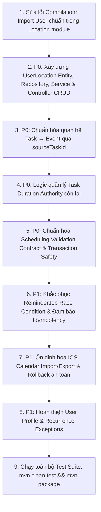

# SMARTSCHEDULE — BACKEND STABILIZATION AUDIT & PLAN

**Location:** `D:\SmartSchedul\backend`  
**Target:** Make the real Spring Boot backend internally correct, consistent, secure, testable, and ready to be the single source of truth.  
**Date:** 2026-09-24  

---

## 1. CURRENT STATE

### 1.1. Technology Stack & Frameworks
- **Framework:** Spring Boot 3.4.4 on Java 21 LTS (`D:\DevTools\Java\jdk-21.0.12.1+1`).
- **Build Tool:** Apache Maven 3.9.16 (bundled with IntelliJ IDEA at `C:\Users\ASUS\IntelliJ IDEA 2026.2.1\plugins\maven-plugin\lib\maven3\bin\mvn.cmd`).
- **Persistence:** Spring Data JPA + Hibernate with `ddl-auto: validate`.
- **Database Engine:** PostgreSQL with Flyway database migration (`classpath:db/migration`).
- **Security:** Spring Security 6, JJWT 0.12.6, BCrypt (strength 12), HttpOnly cookie token rotation.
- **Architectural Pattern:** Modular monolith organized by domain capability (`auth`, `user`, `schedule`, `event`, `task`, `availability`, `scheduling`, `rescheduling`, `category`, `location`, `notification`, `calendar`).

### 1.2. Compilation Status: FAILED (3 Blocker Errors)
Executing `mvn compile` fails with 3 compilation errors:
1. `com/smartschedule/location/api/LocationController.java:[4,37]`
   - `cannot find symbol: class User in package com.smartschedule.auth.domain`
2. `com/smartschedule/location/application/MobilityCheckService.java:[3,37]`
   - `cannot find symbol: class User in package com.smartschedule.auth.domain`
3. `com/smartschedule/location/application/MobilityCheckService.java:[198,36]`
   - `cannot find symbol: class User in MobilityCheckService`

*Root Cause:* The `User` domain entity lives in `com.smartschedule.user.domain.User`, but `LocationController` and `MobilityCheckService` mistakenly import `com.smartschedule.auth.domain.User` (which does not exist).

---

## 2. CONFIRMED PROBLEMS

### 2.1. P0 — Compilation Failure
- Two classes in the `location` package reference a non-existent package `com.smartschedule.auth.domain.User`, blocking any compilation, test runs, or packaging.

### 2.2. P0 — Broken Task ↔ Event Contract
- **Database:** Bảng `events` đã có cột `source_task_id UUID REFERENCES tasks(id) ON DELETE SET NULL` (từ Flyway V5).
- **Entity:** `Event.java` có trường `@Column(name = "source_task_id") private UUID sourceTaskId;`.
- **DTOs:** `EventDtos.EventRequest` và `EventDtos.EventResponse` KHÔNG CÓ trường `sourceTaskId`.
- **Service:** `EventService.java` không gán hoặc trả về `sourceTaskId`.
- **Hệ quả:** Frontend bị buộc phải dùng chuỗi regex/string hack: `event.notes.includes(taskId)`.

### 2.3. P0 — Task Duration Authority
- Backend chưa tự động tính toán và duy trì bất biến:
  $$\text{remainingMinutes} = \max(0, \text{estimatedMinutes} - \sum \text{linkedScheduledDuration})$$
- Hiện tại `Task.java` cho phép cập nhật `remainingMinutes` tùy ý mà không đồng bộ với thời gian thực tế đã xếp lịch trong các `Event` có `sourceTaskId`.

### 2.4. P0 — Broken Scheduling Validation Contract
- `SchedulingController.validate` yêu cầu `@RequestBody ApplyRequest r` (`planId`, `fingerprint`, `slots`, `scheduleVersion`).
- Frontend service `schedulingApi.validate` lại gửi `SchedulingRequest` (`from`, `to`, `taskIds`).
- Backend thiếu một canonical `SchedulingValidationRequest` với ngữ nghĩa rành mạch giữa:
  - `GENERATE`: Sinh đề xuất.
  - `VALIDATE`: Kiểm tra tính khả thi của đề xuất trước phiên bản lịch hiện tại.
  - `APPLY`: Ghi đề xuất vào database (có Transaction & Optimistic Locking).

### 2.5. P0 — Thiếu Write Endpoints cho Custom Locations
- Bảng `user_locations` đã được tạo trong Flyway `V12__user_locations_and_multitenancy.sql`.
- Nhưng trong Java Backend:
  - **Không có** entity `UserLocation.java`.
  - **Không có** repository `UserLocationRepository.java`.
  - **Không có** service `UserLocationService.java`.
  - `LocationController.java` chỉ có `GET /locations` và `GET /locations/{id}` cho campus locations cố định, **hoàn toàn thiếu** `POST /locations`, `PUT /locations/{id}`, `DELETE /locations/{id}`.

### 2.6. P1 — ReminderJob Race Condition
- `ReminderJob.java` quét sự kiện định kỳ mỗi 60 giây (`@Scheduled(fixedDelay = 60000)`).
- Điều kiện lọc:
  ```java
  if (scheduledFor.isBefore(now.minusSeconds(30)) || scheduledFor.isAfter(now.plusSeconds(30))) continue;
  ```
- Cửa sổ thời gian chỉ rộng đúng 60 giây (+/- 30s). Nếu server chịu tải, luồng bị delay hơn 30s, thông báo sẽ bị bỏ lỡ vĩnh viễn.

### 2.7. P1 — Phân định schema V12 (`workspace_id` & `api_keys`)
- `V12__user_locations_and_multitenancy.sql` đã thêm cột `workspace_id` vào các bảng `events`, `tasks`, `categories`, `schedules`, `availability`, và bảng `api_keys`.
- Tuy nhiên mã nguồn Java không có khái niệm `workspace_id` hoặc multi-tenancy qua workspace.
- **Quyết định (theo mục 7 của yêu cầu):** Chọn **Option B** — Sản phẩm hiện tại không dùng multi-tenancy qua workspace. Ghi nhận là schema tương lai (deferred), không ép triển khai giả tạo.

---

## 3. ALREADY CORRECT (CÁC PHẦN ĐÃ CHUẨN MỰC)

1. **Authentication Core (`com.smartschedule.auth`):**
   - Đăng ký, Đăng nhập, Đăng xuất, Cấp mới token (Refresh), Lấy thông tin cá nhân (`/auth/me`).
   - Sử dụng Access Token ngắn hạn (15 phút) trong bộ nhớ, Refresh Token lưu hash SHA-256 trong database với cơ chế thu hồi và xoay vòng token.
   - Mã hóa mật khẩu bằng `BCryptPasswordEncoder(12)`.
2. **Schedule Management & Ownership (`com.smartschedule.schedule`):**
   - Đầy đủ CRUD `Schedule` với phân quyền chặt chẽ thông qua `AuthorizationService` (`OWNER`, `EDITOR`, `VIEWER`).
   - Optimistic Locking qua cột `version` trên `Schedule`.
3. **Collaboration & Public Sharing (`CollaborationController`):**
   - Mời thành viên, phân vai trò, thu hồi quyền, tạo liên kết chia sẻ bảo mật (token ngẫu nhiên 96 ký tự).
   - Xem lịch công khai không cần đăng nhập qua endpoint `GET /api/v1/shared/{token}`.
4. **Category & Availability:**
   - Quản lý danh mục học tập/làm việc gắn với `owner_id`.
   - Quản lý khung giờ rảnh theo ngày trong tuần hoặc ngày cụ thể.
5. **Conflict Detection Engine (`EventConflictService`, `ConflictAnalysisService`):**
   - Kiểm tra trùng giờ tức thời và phân tích xung đột trong khoảng thời gian.
6. **Health Endpoint (`HealthController`):**
   - `GET /api/v1/health` trả về trạng thái `UP`, tên service và timestamp.
7. **Flyway Migrations Structure:**
   - 11 file migration hợp lệ từ V1 đến V12 (bỏ qua V4 tự nhiên, Flyway hỗ trợ chuỗi phiên bản tăng dần không liên tục).

---

## 4. FIX ORDER (THỨ TỰ THỰC HIỆN)



---

## 5. RUNTIME BLOCKERS

1. **Compilation Blocker:** 3 lỗi biên dịch do import sai package trong `LocationController` và `MobilityCheckService`. (Giải quyết ngay tại Bước 1).
2. **Database Verification:** Cần có môi trường test tự động với database thực thi được toàn bộ Flyway migrations (từ V1 đến V12) để xác nhận tính toàn vẹn của DDL trước khi deploy.
