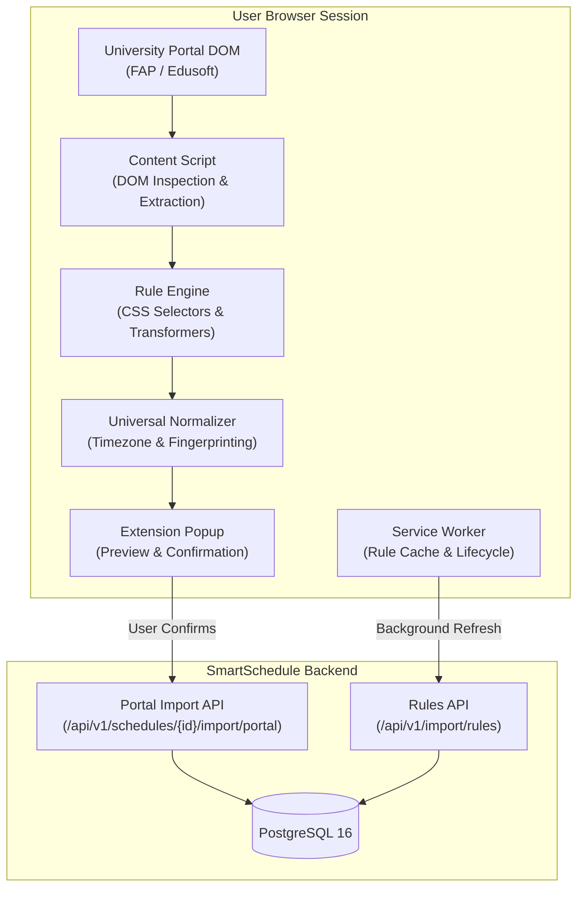

# SmartSchedule Browser Extension — Architecture & Integration Guide

The **SmartSchedule Browser Extension (Universal Schedule Importer)** is a Manifest V3 extension for Chromium-based browsers (Google Chrome, Microsoft Edge, Brave) that extracts class timetable data directly from rendered university portal DOMs and imports it into SmartSchedule.

---

## 1. Architectural Overview



### Core Invariants

1. **Zero Credential Collection**:
   - The extension never requests, reads, intercepts, or transmits university credentials, passwords, session cookies, or authorization tokens.
   - It runs inside the student's already authenticated portal tab and only inspects rendered timetable elements.

2. **Decoupled Dynamic Rule Architecture**:
   - University-specific selectors are **never hardcoded in TypeScript**.
   - Selectors, date formats, time patterns, and regexes live in versioned JSON rules stored locally and updated from the SmartSchedule backend.

3. **Deterministic Idempotency**:
   - Every extracted session receives a deterministic fingerprint (`externalId`).
   - Re-importing an already imported semester schedule produces 0 duplicates.

---

## 2. Manifest V3 & Permissions

The extension uses Chrome Manifest V3 (`extension/manifest.json`):

| Permission | Purpose | Principle of Least Privilege |
| :--- | :--- | :--- |
| `storage` | Local storage of cached rules, user preferences, and import history. | Minimal storage access. |
| `activeTab` | Read rendered schedule DOM on the currently focused university portal tab upon user interaction. | Restricted to user-initiated tab inspection. |
| `scripting` | Dynamic execution of content extraction routines. | Only runs on authorized matching domains. |
| `host_permissions` | `https://*.edu.vn/*`, `http://*.edu.vn/*`, `http://localhost/*`, `http://127.0.0.1/*` | Restricted to educational institution domains and local development environments. |

---

## 3. Dynamic Rule Schema

Rules conform to the `ExtractionRule` interface (`extension/src/rules/types.ts`):

```json
{
  "id": "fpt-fap",
  "name": "FPT Academic Portal (FAP)",
  "provider": "FAP",
  "version": 1,
  "enabled": true,
  "priority": 100,
  "domains": ["fap.fpt.edu.vn", "*.fpt.edu.vn"],
  "pathMatch": "Schedule|Report|ScheduleOfWeek",
  "waitFor": "table",
  "mode": "table-rows",
  "rowSelector": "table.schedule-table tbody tr, table#ctl00_mainContent_divSelect table tr:not(:first-child)",
  "fields": {
    "title": { "selector": ".subject-name, td.subject, td:nth-child(3)", "source": "text", "trim": true },
    "courseCode": { "selector": ".course-code, td.code, td:nth-child(2)", "regex": "([A-Z]{2,4}\\d{3,4}[A-Z]?)", "regexGroup": 1 },
    "date": { "selector": ".session-date, td.date, td:nth-child(1)", "regex": "(\\d{1,2}[/-]\\d{1,2}[/-]\\d{4})", "regexGroup": 1 },
    "timeRange": { "selector": ".session-time, td.time, td:nth-child(4)", "regex": "(\\d{1,2}[:h]\\d{2}\\s*[-–—to]+\\s*\\d{1,2}[:h]\\d{2})", "regexGroup": 1 },
    "location": { "selector": ".session-room, td.room, td:nth-child(5)", "regex": "(?:Phòng|Room)?\\s*([A-Za-z0-9_.-]+)", "regexGroup": 1 },
    "teacher": { "selector": ".session-teacher, td.lecturer, td:nth-child(6)", "regex": "(?:GV|Lecturer|Teacher)?:?\\s*([A-Za-z0-9_.-]+)", "regexGroup": 1 },
    "group": { "selector": ".session-class, td.class, td:nth-child(7)" }
  },
  "dateFormat": "DD/MM/YYYY",
  "timeFormat": "HH:mm",
  "timezone": "Asia/Ho_Chi_Minh"
}
```

---

## 4. Universal Schedule Schema

Extracted data converges to `UniversalScheduleItem`:

```typescript
export interface UniversalScheduleItem {
  title: string;
  courseCode?: string;
  startTime: string; // ISO 8601 string: "2026-09-28T07:30:00+07:00"
  endTime: string;   // ISO 8601 string: "2026-09-28T09:00:00+07:00"
  location?: string; // Room e.g. "BE-301", "P.104"
  teacher?: string;  // Lecturer name e.g. "HuongLT"
  group?: string;    // Class e.g. "SE1701"
  source: string;    // "FAP" | "EDUSOFT" | "GENERIC"
  externalId?: string; // Deterministic fingerprint
  status?: 'SCHEDULED' | 'CONFIRMED' | 'ATTENDED';
  description?: string;
}
```

---

## 5. Supported Providers Status

| Provider | Portal Name | Domain Patterns | Status | Verification Evidence |
| :--- | :--- | :--- | :---: | :--- |
| **FAP** | FPT Academic Portal | `fap.fpt.edu.vn`, `*.fpt.edu.vn` | ✅ VERIFIED | HTML snapshot fixture test in `tests/fapExtraction.test.ts` passing 100%. |
| **EDUSOFT** | Edusoft Portal | `edusoftweb.hcmiu.edu.vn`, `*.edusoft.vn` | ✅ VERIFIED | HTML snapshot fixture test in `tests/edusoftExtraction.test.ts` passing 100%. |
| **GENERIC** | Standard Table Extractor | `*` | 🟡 SCAFFOLD | Basic table selector fallback for standard HTML schedule tables. |

---

## 6. SmartSchedule Backend Import API

### Rule Distribution
- `GET /api/v1/import/rules`: Lists active rules.
- `GET /api/v1/import/rules/match?domain=...&path=...`: Returns highest-priority rule matching domain.

### Schedule Import Pipeline
- `POST /api/v1/schedules/{scheduleId}/import/portal/preview`: Previews sessions, validates date ranges, and detects time conflicts with existing calendar events.
- `POST /api/v1/schedules/{scheduleId}/import/portal`: Idempotently commits events to PostgreSQL and records an entry in `schedule_imports`.
- `GET /api/v1/schedules/{scheduleId}/import/portal/history`: Retrieves the 10 most recent imports for the schedule.

---

## 7. Testing & Verification

Run the extension test suite:

```bash
cd extension
npm test
```

Results:
- **7/7 test files passing (19/19 tests)**.
- Covers domain matcher, date parser, time parser, deduplication, validator, FAP fixture extraction, and Edusoft fixture extraction.

Build the extension:

```bash
npm run build
```

Bundle generated in `extension/dist/`.
Load into Chrome/Edge via `chrome://extensions` → **Load unpacked** → select `extension/dist`.
