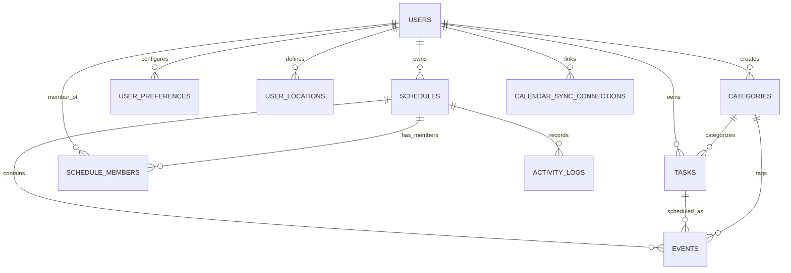

# SmartSchedule Database Architecture & Schema Specification

## 1. Architectural Overview

SmartSchedule uses **PostgreSQL 16** as its canonical relational data store, managed through automated, immutable **Flyway** migrations. The system is designed for multi-tenant user isolation, high concurrent write throughput, strict transaction boundaries, and predictable index performance.



---

## 2. Migration History & Schema Map (V1 to V15)

The database schema has evolved through 15 sequential Flyway versions:

| Version | Migration Script | Purpose & Key Schema Additions |
| :--- | :--- | :--- |
| **V1** | `V1__init_schema.sql` | Core schema: `users`, `categories`, `schedules`, `events`, `tasks`, `user_preferences`. |
| **V2** | `V2__smart_scheduling.sql` | Fixed vs flexible events, task priority, urgency, deadlines. |
| **V3** | `V3__phase3_collaboration_and_activity.sql` | `schedule_members` (RBAC), `activity_logs`. |
| **V4** | `V4__phase4_analytics_and_constraints.sql` | Schedule constraints, energy level modeling, task tags. |
| **V5** | `V5__phase5_calendar_integrations.sql` | External calendar sync: Google Calendar, Outlook, CalDAV tokens. |
| **V6** | `V6__phase6_energy_level_and_notifications.sql` | Energy-aware slot allocation and notification logs. |
| **V7** | `V7__phase7_team_schedules.sql` | Multi-user team schedules, shared availability blocks. |
| **V8** | `V8__phase8_system_settings.sql` | System-wide flags, default work hours, algorithm settings. |
| **V9** | `V9__phase9_event_recurrence.sql` | Recurrence patterns (daily, weekly, RRULE), recurrence exceptions. |
| **V10** | `V10__phase10_campus_routing.sql` | Campus venues, transit matrix, mobility latency factors. |
| **V11** | `V11__phase11_user_locations.sql` | User custom locations (`user_locations`) and coordinate pins. |
| **V12** | `V12__phase12_feedback_learning.sql` | User plan acceptance history, ML adjustment factors. |
| **V13** | `V13__phase13_rate_limiting.sql` | Sliding-window auth rate limiting table / counters. |
| **V14** | `V14__add_schedule_version.sql` | Added `version BIGINT DEFAULT 0 NOT NULL` to `schedules` for optimistic locking. |
| **V15** | `V15__production_indexing_and_concurrency.sql` | Production foreign key index coverage and high-throughput composite indexes. |

---

## 3. Indexing Strategy & Foreign Key Lock Prevention

### 3.1 The PostgreSQL Foreign Key Concurrency Trap
Unlike MySQL (InnoDB), PostgreSQL does **not** automatically generate an index on foreign key columns. In high-concurrency environments, deleting or updating parent table primary keys (e.g. deleting a `category` or removing a `schedule`) requires PostgreSQL to perform a **full sequential scan** on referencing child tables (`events`, `tasks`, `activity_logs`). During this scan, PostgreSQL takes a shared row lock (`SHARE ROW EXCLUSIVE`), which blocks concurrent `INSERT`, `UPDATE`, and `DELETE` queries on the child table, leading to database deadlocks and thread pool starvation.

### 3.2 Indexes Added in V15
Migration `V15__production_indexing_and_concurrency.sql` resolved all missing foreign key indexes and established composite lookup paths:

1. **Foreign Key Locking Prevention**:
   - `idx_events_category_id ON events(category_id)`
   - `idx_tasks_category_id ON tasks(category_id)`
   - `idx_activity_logs_schedule_id ON activity_logs(schedule_id)`
   - `idx_activity_logs_actor_id ON activity_logs(actor_id)`
   - `idx_schedule_members_schedule_id ON schedule_members(schedule_id)`
   - `idx_calendar_sync_connections_user_id ON calendar_sync_connections(user_id)`

2. **High-Throughput Composite Indexes**:
   - `idx_events_task_status ON events(source_task_id, status)`: Accelerates task duration recalculation and linked event lookups without scanning unrelated calendar items.
   - `idx_tasks_schedule_status ON tasks(schedule_id, status)`: Speeds up active task pipeline queries for smart plan proposals.
   - `idx_schedule_members_user_created ON schedule_members(user_id, created_at DESC)`: Rapid workspace retrieval for multi-tenant dashboard rendering.
   - `idx_user_locations_user_name ON user_locations(user_id, name)`: Rapid mobility route geocoding.

---

## 4. Multi-Tenant Isolation & Ownership Model

Data separation is enforced at two distinct boundaries:

### 4.1 Database Layer Isolation
- All tables containing tenant data enforce a foreign key reference to `users(id)` or `schedules(id)`.
- Multi-user collaboration uses `schedule_members` with strict role-based access control (`OWNER`, `EDITOR`, `VIEWER`).

```sql
CREATE TABLE schedule_members (
    id UUID PRIMARY KEY DEFAULT gen_random_uuid(),
    schedule_id UUID NOT NULL REFERENCES schedules(id) ON DELETE CASCADE,
    user_id UUID NOT NULL REFERENCES users(id) ON DELETE CASCADE,
    role VARCHAR(20) NOT NULL CHECK (role IN ('OWNER', 'EDITOR', 'VIEWER')),
    created_at TIMESTAMP WITH TIME ZONE DEFAULT CURRENT_TIMESTAMP,
    CONSTRAINT uk_schedule_member UNIQUE (schedule_id, user_id)
);
```

### 4.2 Application Service Boundary Isolation
- The authenticated user's ID is extracted directly from the verified cryptographic JWT claims in `SecurityContextHolder`.
- All repository queries filter by `userId` or verify schedule membership via `ScheduleMemberRepository.findByScheduleIdAndUserId(scheduleId, userId)`.
- If an unprivileged user attempts to modify or view another user's schedules or tasks, the service returns `403 FORBIDDEN` or `404 NOT FOUND`.

---

## 5. HikariCP Connection Pool Sizing & Sizing Math

Connection pool sizing follows the PostgreSQL and CockroachDB empirical formula:

$$\text{Connections} = (\text{CPU Cores} \times 2) + \text{Effective Spindle Count}$$

### 5.1 Hardware Sizing Calculations
For modern NVMe/SSD containerized deployments, effective spindle count is estimated at $1$ to $4$ due to non-blocking I/O:

- **2-Core Host (Standard Container)**:
  $$\text{Connections} = (2 \times 2) + 2 = 6 \text{ to } 10$$
- **4-Core Host (Production Node)**:
  $$\text{Connections} = (4 \times 2) + 4 = 12 \text{ to } 16$$
- **8-Core Host (Dedicated Cluster)**:
  $$\text{Connections} = (8 \times 2) + 8 = 24 \text{ to } 30$$

### 5.2 Sizing Math vs HTTP Throughput
A common mistake is allocating hundreds of connections to support hundreds of concurrent HTTP clients. Because an average SmartSchedule query executes in $2\text{ms} - 8\text{ms}$:

$$\text{Capacity per Connection} = \frac{1000\text{ms}}{6\text{ms average transaction}} \approx 166 \text{ queries/sec}$$

A pool of **25 active connections** can sustain:
$$25 \times 166 \approx 4,150 \text{ database transactions/second}$$

This comfortably handles **1,000+ active concurrent web users** without exhausting PostgreSQL server memory or creating CPU cache thrashing.

### 5.3 Production Configuration (`application-prod.yml`)
```yaml
spring:
  datasource:
    hikari:
      maximum-pool-size: 25
      minimum-idle: 5
      connection-timeout: 20000 # 20 seconds wait before failure
      idle-timeout: 300000      # 5 minutes idle eviction
      max-lifetime: 1200000     # 20 minutes maximum connection lifespan
      pool-name: SmartScheduleHikariPool
```

---

## 6. Primary Key Strategy (UUIDv4)

- **Storage**: All tables use 16-byte native `UUID` (`UUID PRIMARY KEY DEFAULT gen_random_uuid()`).
- **Security**: Eliminates sequential ID enumeration attacks (OWASP API Vulnerability).
- **Distributed Generation**: IDs can be generated on client or server without coordinating round-trips to the database.
- **Index Optimization**: Handled natively by PostgreSQL B-Tree indexes, maintaining fast seek times across millions of records.
