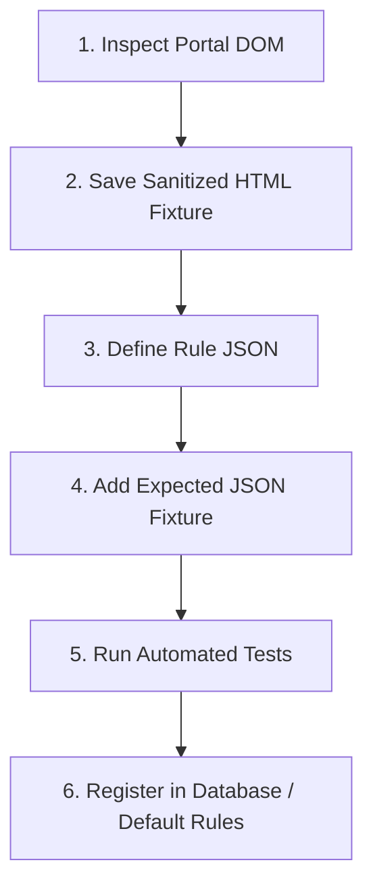

# SmartSchedule — Extension Rule Authoring Guide

This guide describes how to add support for a new university student portal or calendar format using SmartSchedule's dynamic extraction rule architecture.

**Core Principle**: You do **NOT** need to edit the extension's core TypeScript code to support a new university. You only need to define a new JSON rule and an accompanying test fixture.

---

## 1. Authoring Workflow



---

## 2. Step-by-Step Instructions

### Step 1: Inspect Portal DOM

Open the target student portal in Chrome/Edge DevTools (F12):
1. Identify the container table or schedule elements (e.g. `table.grid`, `div.timetable-container`).
2. Identify the repeating row or cell selector:
   - For row-based schedules: `table tbody tr`
   - For calendar grids: `table tbody td`
3. Inspect how fields are formatted in each row/cell:
   - Subject Title: CSS selector or column index (`td:nth-child(3)`).
   - Course Code: Regex pattern (e.g. `([A-Z]{2,4}\d{3,4})`).
   - Date: Date string format (`DD/MM/YYYY`, `YYYY-MM-DD`).
   - Time / Slot: Time pattern (`07:30 - 09:00` or slot number).
   - Room: Classroom code (`BE-301`, `P.204`).
   - Teacher: Lecturer name or code.

---

### Step 2: Create Test Fixture

1. Copy the table HTML snippet from the portal DOM.
2. **Crucial**: Sanitize personal student information (replace real student names, IDs, GPA with synthetic data).
3. Save to `extension/tests/fixtures/<provider_id>/schedule.html`.
4. Create `extension/tests/fixtures/<provider_id>/expected.json` with the expected `UniversalScheduleItem[]` output.

---

### Step 3: Define Rule JSON

Create the rule specification according to `ExtractionRule`:

```json
{
  "id": "my-university-portal",
  "name": "My University Student Portal",
  "provider": "MY_UNI",
  "version": 1,
  "enabled": true,
  "priority": 80,
  "domains": ["portal.myuni.edu.vn", "*.myuni.edu.vn"],
  "pathMatch": "Schedule|ThoiKhoaBieu",
  "waitFor": "table.schedule-table",
  "mode": "table-rows",
  "rowSelector": "table.schedule-table tbody tr",
  "fields": {
    "title": {
      "selector": "td.col-title, td:nth-child(2)",
      "source": "text",
      "trim": true
    },
    "courseCode": {
      "selector": "td.col-code, td:nth-child(1)",
      "regex": "([A-Z0-9]+)",
      "regexGroup": 1
    },
    "date": {
      "selector": "td.col-date, td:nth-child(3)",
      "regex": "(\\d{1,2}[/-]\\d{1,2}[/-]\\d{4})",
      "regexGroup": 1
    },
    "timeRange": {
      "selector": "td.col-time, td:nth-child(4)",
      "regex": "(\\d{1,2}[:h]\\d{2}\\s*[-–—]+\\s*\\d{1,2}[:h]\\d{2})",
      "regexGroup": 1
    },
    "location": {
      "selector": "td.col-room, td:nth-child(5)",
      "regex": "(?:Phòng|Room)?\\s*([A-Za-z0-9_.-]+)",
      "regexGroup": 1
    },
    "teacher": {
      "selector": "td.col-lecturer, td:nth-child(6)"
    }
  },
  "dateFormat": "DD/MM/YYYY",
  "timeFormat": "HH:mm",
  "timezone": "Asia/Ho_Chi_Minh"
}
```

---

### Step 4: Write Automated Fixture Test

Create `extension/tests/<provider_id>Extraction.test.ts`:

```typescript
import { describe, it, expect } from 'vitest';
import { readFileSync } from 'fs';
import { resolve } from 'path';
import { JSDOM } from 'jsdom';
import { RuleBasedExtractionStrategy } from '../src/extraction/strategies/RuleBasedExtractionStrategy';

describe('My University Extraction — Fixture Test', () => {
  it('extracts timetable accurately', async () => {
    const html = readFileSync(resolve(__dirname, 'fixtures/myuni/schedule.html'), 'utf-8');
    const expected = JSON.parse(readFileSync(resolve(__dirname, 'fixtures/myuni/expected.json'), 'utf-8'));
    const dom = new JSDOM(html, { url: 'https://portal.myuni.edu.vn/Schedule' });

    const strategy = new RuleBasedExtractionStrategy();
    const result = await strategy.extract({
      document: dom.window.document,
      url: 'https://portal.myuni.edu.vn/Schedule',
      rule: MY_UNI_RULE,
    });

    expect(result.items.length).toBe(expected.length);
  });
});
```

---

### Step 5: Run Tests & Register Rule

Run:

```bash
cd extension
npm test
```

Once tests pass:
1. Add the rule to `extension/src/rules/defaultRules.ts` for offline support.
2. Insert or update the rule in the backend `extraction_rules` table via a new Flyway migration or admin API.
